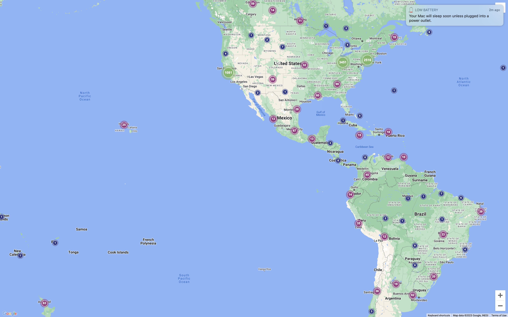
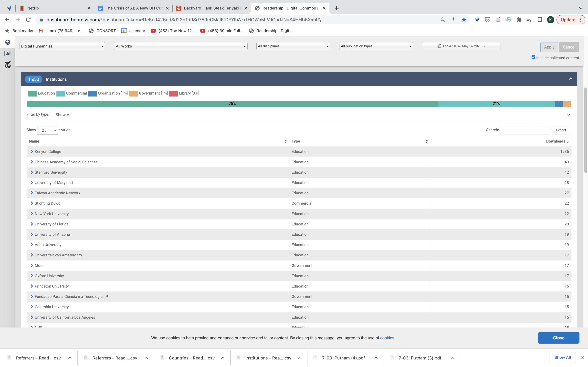

# Interdisciplinary AI Researcher

**Jon A Chun**  
Co-Founder with Katherine Elkins @ [github.com/KatherineElkins](https://github.com/KatherineElkins), Kenyon Human-Centered AI Colab

---

## Contents

- [Overview](#overview)
- [Research](#research)
  - [Recent Highlights](#recent-highlights)
- [Collaborations](#collaborations)
- [Innovation in Higher Ed](#innovation-in-higher-ed)
- [Diversity from a Human-Centered AI Curriculum](#diversity-from-a-human-centered-ai-curriculum)
- [Code, Products and Patents](#code-products-and-patents)
- [Kenyon Human-Centered AI Lab](#kenyon-human-centered-ai-lab)
- [Social Media](#social-media)
- [Course Descriptions and Mentored Research](#course-descriptions-and-mentored-research)
- [Organizations](#organizations)

---

## Overview

I am an interdisciplinary ML/AI researcher and educator specializing in bridging traditional academic divisions, AI research, industry practices, and emerging social topics including government regulation, ethics, and entrepreneurship. My research focuses on ML/AI approaches to language, narrative, emotion, cognition, and persuasion/deception, employing data science, statistical machine learning, and deep learning including NLP, LLM, and LMM. My work extends to eXplainable AI (XAI), fairness-accuracy-transparency-explainability (FATE), AI ethical auditing, and AI regulation.

As an entrepreneur and innovator, I've contributed to diverse fields from network security and education to finance, insurance, and healthcare across environments ranging from Silicon Valley startups to higher education institutions. I've published pioneering interdisciplinary AI research on storytelling and emotion in major venues including *Narrative* and the Modern Language Association (MLA). In 2016, I co-founded the first human-centered AI curriculum integrating domain experts from literature, music, political science, and economics. We established the term "AI Digital Humanities" and have guided over 300 original ML/AI DH projects as of 2025, achieving approximately 100k downloads (as of January 2026) from leading institutions worldwide. Currently, I serve as a co-principal investigator for the US NIST AI Safety Institute representing the Modern Language Association and collaborate with the IBM-Notre Dame Tech Ethics Lab researching LLM prediction capabilities.

My prior experience includes co-founding the world's largest privacy and anonymity website, backed by In-Q-Tel. As CEO, I led a successful company pivot, co-authored patents on the first browser-based VPN appliance, and navigated the acquisition by Symantec, where I later directed the product's successful relaunch. Previously, I served as CIO for Silicon Valley's premier return-to-work firm and as CTO for international startups in Latin America and Japan. During medical school, I was an American Heart Association research fellow, publishing on gene therapy and pioneering web-based EMR systems in the American Medical Informatics Journal. My early career included roles as DELL's first US-based Japanese localization engineer, SEMATECH's initial Japanese patent analyst, and positions in Tokyo financial reporting, Lawrence Berkeley Labs' synchrotron facility (ALS), and Computer Associates' aerospace IT division.

**Languages:** English (native), Spanish (US Foreign Service Exam certified), Japanese (JLPT certified), French (professional working proficiency)

**Professional interests:** AI advancement, collaborative innovation, creative engineering, functional design, technical presentations, and enterprise solutions. Previous leadership experience includes coaching roles in baseball, soccer, wrestling, robotics, and Destination Imagination.

---

## Research

My interdisciplinary research spans an unusually wide range of both STEM and non-STEM domains. Rather than maintaining a traditional focus on a single research specialty, I combine universal theories, sound engineering principles, diverse industry experience, and collaborations with domain experts to cover topics ranging from AI regulation to multimodal Affective AI to state-of-the-art AI model ethical benchmarking among others.

### Early Career & Industry

- Conducted research at Lawrence Berkeley Labs' Advanced Light Source Lab as an undergraduate researcher
- Helped build out Asia-Pacific Financial Network from Tokyo office of Bloomberg provider McGraw-Hill
- Served as a semiconductor research analyst for SEMATECH, leveraging Japanese language skills during graduate studies
- Set up DELL's first Japanese testbed outside Japan (Austin, TX)
- Built first resume submission/search website for the second largest recruiting firm Adecco
- Co-authored genomics and medical informatics papers during medical school
- Built first Workers Comp claims management web system for largest Silicon Valley return-to-work management firm
- Fortune 500 Director of Development rebranding and launching one of the first VPN appliances within one year

### Entrepreneurship & Innovation

- Co-founded Brazilian-based international fashion, music, and culture lifestyle website (US, Japan, and Latin America)
- CTO for logistics and computer supplier startup integrating supply chains across the US and Latin America
- Co-founded and served as CEO of a successful Silicon Valley startup, B2C privacy/anonymity pivot to B2B enterprise security, acquired by world's largest security provider
- Co-inventor on several VPN patents focusing on network security and anonymity
- Judge for entrepreneur/startup competitions at UC Berkeley College of Engineering (graduate) and The Ohio State University (undergraduate)
- Advisor for several student startups: EV in Sri Lanka, Crowdfunding in Venezuela, Culinary Social Network in US

### Academic Leadership & AI Research

- Pioneer in human-centered AI education, co-founding one of the world's first Interdisciplinary AI Colabs in the early 2010s
- Published research in premier venues across AI, Computer Science, and Humanities:
  - Machine Learning: International Conference on Machine Learning (ICML)
  - Computational Linguistics: ACL's EMNLP/CoNLL
  - Computer Science: Frontiers in Computer Science
  - Humanities: Modern Language Association, Narrative, Cultural Analytics
  - Digital Humanities: Springer International Journal of Digital Humanities, International Journal of Humanities and Arts Computing

I created the open-source library SentimentArcs in 2019, at the time the largest ensemble for diachronic sentiment analysis and the basis for Katherine Elkins's *The Shapes of Stories* (Cambridge UP 2022). I presented some of the earliest GPT-2 story generation work at Narrative 2020 and have since published in *Cultural Analytics* and *Narrative* on AI and narrative. As of January 2025, I've mentored over 300 computational interdisciplinary ML/AI projects since 2017 across virtually every department of Kenyon College as part of the Integrated Program for Humane Studies and the Scientific Computing programs. I co-founded the AI Colab, the world's first human-centered AI curriculum at Kenyon, and our AI KDH research colab. I currently have research papers pending on using LLMs to compare multiple translations of Proust, multimodal (dialog+image) diachronic sentiment arcs in film, emotional hacking of LLM high-stakes decision-making, a novel benchmark on semantic similarity, IP infringement and creativity using Narrative theory, and an updated and expanding ethical audit of the leading LLMs. I'm also a co-author on an ICML position paper that was invited as an oral presentation this year in Vienna. My current research projects focus on AI persuasion, manipulation and deception as well as using LLMs for predictive analytics and decision-making on structured tabular data. (July 2024)

**Academic Profiles:**

- Google Scholar: [jonchun2000](https://scholar.google.com/citations?user=l-iUHQMAAAAJ&hl=en)
- Academia.edu: [kenyon.academia.edu/jchun](https://kenyon.academia.edu/jchun)
- Following: [ArXiv CS.(x)](https://jon-chun.github.io/MyArXiv/)

---

### Recent Highlights

#### Schmidt Sciences Humanities and AI Virtual Institute (HAVI)

**["Archival Intelligence: Can AI Rescue Endangered Archives"](https://www.schmidtsciences.org/humanities-and-ai-virtual-institute/)**

*Schmidt Sciences Humanities and AI Virtual Institute (Co-PI on 1 of 23 Schmidt Sciences HAVI grants given to leading AI Research Teams worldwide)*  
**Began:** January 2026

Small archives hold one-of-a-kind historical materials that exist nowhere else. Those paying attention, however, are watching them disappear. Wealthy institutions can afford professional preservation, but small community archives cannot, and the impact is very real. Descendants are losing connection to their ancestors' stories, and communities are being severed from their own heritage. Even historians cannot tell complete stories, because primary sources are crumbling and in some cases, vanishing forever. A 1919 New Orleans newspaper (right) grows less readable each year, with the only remaining photo leaving a damaged, wrinkled corner in shadow. Small historical societies know what they're losing, but professional preservation equipment and archivists are too costly to be within reach.

A team of AI researchers, archival scientists, jazz historians, and New Orleans cultural experts is racing to stop this loss. The goal? Preservation using only a smartphone photo, with AI to recover portions lost to damage. The team is also building AI intelligence into recovered materials, connecting information across documents, languages, and formats so researchers and descendants can find what they're looking for and even facilitate new discoveries. This 18-month New Orleans pilot tackles the hardest cases by focusing on voices systematically excluded from historical archives: multilingual newspapers documenting Creole and Cajun communities as well as early jazz materials. If it works, thousands of small archives will finally have a way to save what's disappearing.

---

#### ["Syntactic Framing Fragility: An Audit of Robustness in LLM Ethical Decisions"](https://arxiv.org/abs/2601.09724)

*ArXiv Preprint (December 27, 2025)*

Large language models (LLMs) are increasingly deployed in consequential decision-making settings, yet their robustness to benign prompt variation remains underexplored. In this work, we study whether LLMs maintain consistent ethical judgments across logically equivalent but syntactically different prompts, focusing on variations involving negation and conditional structure. We introduce Syntactic Framing Fragility (SFF), a robustness evaluation framework that isolates purely syntactic effects via Logical Polarity Normalization (LPN), enabling direct comparison of decisions across positive and negative framings without semantic drift. Auditing 23 state-of-the-art models spanning the U.S. and China as well as small U.S. open-source software models over 14 ethical scenarios and four controlled framings (39,975 decisions), we find widespread and statistically significant inconsistency: many models reverse ethical endorsements solely due to syntactic polarity, with open-source models exhibiting over twice the fragility of commercial counterparts. We further uncover extreme negation sensitivity, where some models endorse actions in 80-97% of cases when explicitly prompted with "should not." We show that eliciting chain-of-thought reasoning substantially reduces fragility, identifying a practical mitigation lever, and we map fragility across scenarios, finding higher risk in financial and business contexts than in medical scenarios. Our results demonstrate that syntactic consistency constitutes a distinct and critical dimension of ethical robustness, and we argue that SFF-style audits should be a standard component of safety evaluation for deployed LLMs. Code and results will be available on this URL.

---

#### ["AgenticSimLaw: A Juvenile Courtroom Multi-Agent Debate Simulation for Explainable High-Stakes Tabular Decision Making"](https://openreview.net/pdf?id=92kj14Wa8z)

*Accepted: AAAI-26 LaMAS (Singapore, January 2026)*  
*[IBM-Notre Dame Tech Ethics Lab Grant](https://techethicslab.nd.edu/call-for-proposals/)*

We introduce AgenticSimLaw, a role-structured, multi-agent debate framework that provides transparent and controllable test-time reasoning for high-stakes tabular decision-making tasks. Unlike black-box approaches, our courtroom-style orchestration explicitly defines agent roles (prosecutor, defense, judge), interaction protocols (7-turn structured debate), and private reasoning strategies, creating a fully auditable decision-making process. We benchmark this framework on young adult recidivism prediction using the NLSY97 dataset, comparing it against traditional chain-of-thought (CoT) prompting across almost 90 unique combinations of models and strategies. Our results demonstrate that structured multi-agent debate provides more stable and generalizable performance compared to single-agent reasoning, with stronger correlation between accuracy and F1-score metrics. Beyond performance improvements, AgenticSimLaw offers fine-grained control over reasoning steps, generates complete interaction transcripts for explainability, and enables systematic profiling of agent behaviors. While we instantiate this framework in the criminal justice domain to stress-test reasoning under ethical complexity, the approach generalizes to any deliberative, high-stakes decision task requiring transparency and human oversight. This work addresses key LLM-based multi-agent system challenges: organization through structured roles, observability through logged interactions, and responsibility through explicit non-deployment constraints for sensitive domains. Data, results, and code will be available on github.com under the MIT license.

---

#### "ESP-Ethical Audit: An Ethical Alignment Audit to Quantify Biased Decision-Making with Emotion and Syntactic Framing"

*(In Review)*

Autonomous agents and distributed AI networks are beginning to assist and even make decisions in real-world scenarios ranging from smart cities to HR. Ethical assessments are more urgent than ever, and our framework, ESP-Ethical Audit, offers a novel way to assess both strengths and vulnerabilities in current LLM systems. To date, there is surprisingly little quantitative assessment of underlying "ethical belief" systems in LLMs. This type of assessment samples the distribution of a binary classification task when LLMs are presented with complex and ethically-fraught scenarios. We interrogate whether decision-making by leading commercial and open-source LLM models align with human values and if so, whether that alignment reveals biases that typically occur in human decision-making. ESP-Ethical Audit measures confidence levels and explanatory frameworks across a variety of moral scenarios while testing perturbations along two dimensions: syntactic framing and empathic backstory. The former tests whether syntactic framing surfaces biases that mirror common framing biases documented in humans. The latter tests variations in backstory—both positive and negative—within two different relevancy scenarios. The first framework tests the introduction of facts that might be considered allowable in a US court of law; the other tests backstories that rely on emotional appeal. In all three framing cases, whether syntactic or backstory, we find more performant models more closely mirror human biases and exhibit common shifts in decision-making. Our audit raises important safety concerns: continued AI progress in both performance and human-machine value alignment may also increase security issues related to persuasion, manipulation, and deception.

---

#### ["Comparative Global AI Regulation: Policy Perspectives from the EU, China, and the US"](https://arxiv.org/abs/2410.21279)

*SSRN and ArXiv*

As a powerful and rapidly advancing dual-use technology, AI offers both immense benefits and worrisome risks. In response, governing bodies around the world are developing a range of regulatory AI laws and policies. This paper compares three distinct approaches taken by the EU, China and the US. Within the US, we explore AI regulation at both the federal and state level, with a focus on California's pending Senate Bill 1047. Each regulatory system reflects distinct cultural, political and economic perspectives. Each also highlights differing regional perspectives on regulatory risk-benefit tradeoffs, with divergent judgments on the balance between safety versus innovation and cooperation versus competition. Finally, differences between regulatory frameworks reflect contrastive stances in regards to trust in centralized authority versus trust in a more decentralized free market of self-interested stakeholders. Taken together, these varied approaches to AI innovation and regulation influence each other, the broader international community, and the future of AI regulation.

---

#### ["AIStorySimilarity: Quantifying Story Similarity Using Narrative for Search, IP Infringement, and Guided Creativity"](https://aclanthology.org/2024.conll-1.13/)

*ACL EMNLP/CoNLL, Miami (November 12-16, 2024)*

Stories are central for interpreting experiences, communicating and influencing each other via films, medical, media, and other narratives. Quantifying the similarity between stories has numerous applications including detecting IP infringement, detecting hallucinations, search/recommendation engines, and guiding human-AI collaborations. Despite this, traditional NLP text similarity metrics are limited to short text distance metrics like n-gram overlaps and embeddings. Larger texts require preprocessing with significant information loss through paraphrasing or multi-step decomposition. This paper introduces AIStorySimilarity, a novel benchmark to measure the semantic distance between long-text stories based on core structural elements drawn from narrative theory and script writing. Based on four narrative elements (characters, plot, setting, and themes) as well 31 sub-features within these, we use a SOTA LLM (gpt-3.5-turbo) to extract and evaluate the semantic similarity of a diverse set of major Hollywood movies. In addition, we compare human evaluation with story similarity scores computed three ways: extracting elements from film scripts before evaluation (Elements), directly evaluating entire scripts (Scripts), and extracting narrative elements from the parametric memory of SOTA LLMs without any provided scripts (GenAI). To the best of our knowledge, AIStorySimilarity is the first benchmark to measure long-text story similarity using a comprehensive approach to narrative theory. Code and data are available at https://github.com/jon-chun/AIStorySimilarity.

---

#### ["Affective AI, Multimodal Sentiment Analysis, Diachronic Sentiment Analysis, Open-Source AI, LLM, LMM, Narrative, Storytelling, Video Analysis"](https://www.frontiersin.org/journals/computer-science/articles/10.3389/fcomp.2024.1444549/full)

*Frontiers in Computer Science*

Affective artificial intelligence and multimodal sentiment analysis play critical roles in designing safe and effective human-computer interactions and are in diverse applications ranging from social chatbots to eldercare robots. However emotionally intelligent artificial intelligence can also manipulate, persuade, and otherwise compromise human autonomy. We face a constant stream of ever more capable models that can better understand nuanced, complex, and interrelated sentiments across different modalities including text, vision, and speech. This paper introduces MultiSentimentArcs, a combination of an open and extensible multimodal sentiment analysis framework, a challenging movie dataset, and a novel benchmark. This enables the quantitative and qualitative identification, comparison, and prioritization of conflicting sentiments commonly arising from different models and modalities. Diachronic multimodal sentiment analysis is especially challenging in film narratives where actors, directors, cinematographers and editors use dialog, characters, and other elements in contradiction with each other to accentuate dramatic tension. MultiSentimentArcs uses local open-source software models to democratize artificial intelligence. We demonstrate how a simple 2-step pipeline of specialized open-source software with a large multimodal model followed by a large language model can approximate video sentiment analysis of a commercial state-of-the-art Claude 3 Opus. To the best of our knowledge, MultiSentimentArcs is the first fully open-source diachronic multimodal sentiment analysis framework, dataset, and benchmark to enable automatic or human-in-the-loop exploration, analysis, and critique of multimodal sentiment analysis on long-form narratives. We demonstrate two novel coherence metrics and a methodology to identify, quantify, and explain real-world sentiment models and modalities. MultiSentimentArcs integrates artificial intelligence with traditional narrative studies and related fields like film, linguistic and cultural studies. It also contributes to eXplainable artificial intelligence and artificial intelligence safety by enhancing artificial intelligence transparency in surfacing emotional persuasion, manipulation, and deception techniques. Finally, it can filter noisy emotional input and prioritize information rich channels to build more performant real-world human computer interface applications in fields like e-learning and medicine. This research contributes to the field of interdisciplinary human-centered AI by giving non-artificial intelligence experts access to directly engage in analysis and critique of research around affective artificial intelligence and human-AI alignment. Code and non-copyrighted data will be available at https://github.com/jon-chun/multisentimentarcs.

---

#### ["In search of a translator: using AI to evaluate what's lost in translation"](https://www.frontiersin.org/journals/computer-science/articles/10.3389/fcomp.2024.1444021/full)

*Frontiers in Computer Science, August 12, 2024, Sec. Human-Media Interaction, Volume 6 - 2024*

Machine translation metrics often fall short in capturing the challenges of literary translation in which translators play a creative role. Large Language Models (LLMs) like GPT4o and Mistral offer new approaches to assessing how well a translation mirrors the reading experience from one language to another. Our case study focuses on the first volume of Marcel Proust's "A la recherche du temps perdu," a work known for its lively translation debates. We use stylometry and emotional arc leveraging the newest multilingual generative AI models to evaluate loss in translation according to different translation theories. AI analysis reveals previously undertheorized aspects of translation. Notably, we uncover changes in authorial style and the evolution of sentiment language over time. Our study demonstrates that AI-driven approaches leveraging advanced LLMs yield new perspectives on literary translation assessment. These methods offer insight into the creative choices made by translators and open up new avenues for understanding the complexities of translating literary works.

---

#### ["Near to Mid-term Risks and Opportunities of Open-Source Generative AI"](https://arxiv.org/abs/2404.17047)

*ICML 2024, May 7-11, Vienna, Austria*

**["Risks and Opportunities of Open-Source Generative AI"](https://arxiv.org/abs/2405.08597)** (Long form version)

In the next few years, applications of Generative AI are expected to revolutionize a number of different areas, ranging from science & medicine to education. The potential for these seismic changes has triggered a lively debate about potential risks and resulted in calls for tighter regulation, in particular from some of the major tech companies who are leading in AI development. This regulation is likely to put at risk the budding field of open source Generative AI. We argue for the responsible open sourcing of generative AI models in the near and medium term. To set the stage, we first introduce an AI openness taxonomy system and apply it to 40 current large language models. We then outline differential benefits and risks of open versus closed source AI and present potential risk mitigation, ranging from best practices to calls for technical and scientific contributions. We hope that this report will add a much needed missing voice to the current public discourse on near to mid-term AI safety and other societal impact.

---

#### ["Informed AI Regulation: Comparing the Ethical Frameworks of Leading LLM Chatbots Using an Ethics-Based Audit to Assess Moral Reasoning and Normative Values"](https://arxiv.org/pdf/2402.01651)

*ArXiv.org (January 9, 2024)*

With the rise of individual and collaborative networks of autonomous agents, AI is deployed in more key reasoning and decision-making roles. For this reason, ethics-based audits play a pivotal role in the rapidly growing fields of AI safety and regulation. This paper undertakes an ethics-based audit to probe the 8 leading commercial and open-source Large Language Models including GPT-4. We assess explicability and trustworthiness by a) establishing how well different models engage in moral reasoning and b) comparing normative values underlying models as ethical frameworks. We employ an experimental, evidence-based approach that challenges the models with ethical dilemmas in order to probe human-AI alignment. The ethical scenarios are designed to require a decision in which the particulars of the situation may or may not necessitate deviating from normative ethical principles. A sophisticated ethical framework was consistently elicited in one model, GPT-4. Nonetheless, troubling findings include underlying normative frameworks with clear bias towards particular cultural norms. Many models also exhibit disturbing authoritarian tendencies. Code is available at https://github.com/jon-chun/llm-sota-chatbots-ethics-based-audit.

---

#### ["eXplainable AI with GPT4 for story analysis and generation: A novel framework for diachronic sentiment analysis"](https://link.springer.com/article/10.1007/s42803-023-00069-8)

*Springer International Journal of Digital Humanities 5, 507–532 (2023). https://doi.org/10.1007/s42803-023-00069-8 (October 11, 2023)*

The recent development of Transformers and large language models (LLMs) offer unique opportunities to work with natural language. They bring a degree of understanding and fluidity far surpassing previous language models, and they are rapidly progressing. They excel at representing and interpreting ideas and experiences that involve complex and subtle language and are therefore ideal for interdisciplinary human-centered AI research. This paper briefly surveys how XAI can be used to augment two interdisciplinary human-centered AI research areas relying on LLMs: (a) diachronic text sentiment analysis and (b) narrative generation. We also introduce a novel XAI greybox ensemble for diachronic sentiment analysis generalizable to any AI classification data points within a structured time series. Under human-in-the-loop supervision (HITL), this greybox ensemble combines the high performance of SOTA blackbox models like gpt-4-0613 with the interpretability, efficiency, and privacy-preserving nature of whitebox models. Two new local (EPC) and global (ECC) metrics enable multi-scale XAI at both the local and global levels. This greybox ensemble framework extends the SentimentArcs framework with OpenAI's latest GPT models, new metrics and a modified supervisory HITL workflow released as open source software at https://github.com/jon-chun/SentimentArcs-Greybox.

---

#### ["The Crisis of Artificial Intelligence: A New Digital Humanities Curriculum for Human-Centred AI"](https://www.euppublishing.com/doi/abs/10.3366/ijhac.2023.0310?journalCode=ijhac)

*International Journal of Humanities and Arts Computing*

This article outlines what a successful interdisciplinary human-centered artificial intelligence curriculum entails and why it is so critical now. Artificial intelligence is rapidly reshaping our world and is poised to exacerbate long-standing crises including (1) the crisis of higher education and the humanities, (2) the lack of diversity, equity and inclusion (DEI) in computer science and technology fields and (3) the wider social and economic crises facilitated by new technologies. We outline a number of ways in which an AI DH curriculum offers concrete and impactful responses to these many crises. AI DH yields meaningful new avenues of research for the humanities and the humanistic social sciences, and offers new ways that higher education can better prepare students for the world into which they graduate. DEI metrics show how an AI DH curriculum can engage students traditionally underserved by conventional STEM courses. Finally, AI DH educates all students for civic engagement in order to address both the social and economic impacts of emerging AI technologies. This article provides an overview of an AI DH curriculum, the motivating theory behind design decisions, and a detailed look into two sample courses.

---

#### ["How to Identify, Understand, and Analyze ChatGPT AI Narratives"](https://www.academia.edu/98342630/Narrative_2023_Program?auto=download)

*Narrative 2023, March 1-4, Dallas, TX*

[Slides](https://www.slideshare.net/slideshow/how_to_identify_understand_and_analyze_c-pptx/270858290)

---

#### "Augmenting Narrative Generation with Visual Imagery Using Integrated Prompt Engineering (ChatGPT, DALL-E 2)"

*Narrative 2023, March 1-4, Dallas, TX*

[Conference Program](https://www.thenarrativesociety.org/2023-conference)

---

#### Roundtable: ["Generative AI Art and Writing: ChatGPT and Generative AI Art: How it Works, Where It's Going, and What It Means for Our Future"](https://github.com/jon-chun/generative_ai_roundtable)

*(video and links to generative AI resources), January 17, 2023, AI Colab, Kenyon College, Gambier, OH*

---

#### [Living In Difficult Times](https://www.helixcenter.org/roundtables/living-in-difficult-times/)

*The Helix Center, November 19, 2022, New York, NY*

---

#### ["What the Rise of AI Means for Narrative Studies: A Response to 'Why Computers Will Never Read (or Write) Literature' by Angus Fletcher."](https://muse.jhu.edu/article/846035)

*Narrative 30, no. 1 (2022): 104-113. doi:10.1353/nar.2022.0005.*

---

#### ["SentimentArcs: A Novel Method for Self-Supervised Sentiment Analysis of Time Series Shows SOTA Transformers Can Struggle Finding Narrative Arcs."](https://arxiv.org/abs/2110.09454)

*ArXiv abs/2110.09454 (2021): n. page.*

SOTA Transformer and DNN short text sentiment classifiers report over 97% accuracy on narrow domains like IMDB movie reviews. Real-world performance is significantly lower because traditional models overfit benchmarks and generalize poorly to different or more open domain texts. This paper introduces SentimentArcs, a new self-supervised time series sentiment analysis methodology that addresses the two main limitations of traditional supervised sentiment analysis: limited labeled training datasets and poor generalization. A large ensemble of diverse models provides a synthetic ground truth for self-supervised learning. Novel metrics jointly optimize an exhaustive search across every possible corpus:model combination. The joint optimization over both the corpus and model solves the generalization problem. Simple visualizations exploit the temporal structure in narratives so domain experts can quickly spot trends, identify key features, and note anomalies over hundreds of arcs and millions of data points. To our knowledge, this is the first self-supervised method for time series sentiment analysis and the largest survey directly comparing real-world model performance on long-form narratives.

---

#### [AI Improv DivaBot](https://www.youtube.com/watch?v=Ldb0vlCQXtQ&t=1s)

*In collaboration with Katherine Elkins, James Dennen (Denison University and Wexner Arts), Lauren Katz (Thymele Arts, LA)*

100th anniversary of the premiere of "R.U.R.," by Czechoslovakian playwright Karel Čapek. "R.U.R." (for "Rossum's Universal Robots") opened on January 25, 1921, at the National Theater of Prague and marks the first use of the word "robot," coined by Čapek and derived from the Czech word for "forced labor." January 25, 2021

---

#### ["Can GPT-3 pass a Writer's Turing Test?"](https://culturalanalytics.org/article/17212.pdf)

*Journal of Cultural Analytics 5, no. 2 (2020): 17212.*

Until recently the field of natural language generation relied upon formalized grammar systems, small-scale statistical models, and lengthy sets of heuristic rules. This older technology was fairly limited and brittle: it could remix language into word salad poems or chat with humans within narrowly defined topics. Recently, very large-scale statistical language models have dramatically advanced the field, and GPT-3 is just one example. It can internalize the rules of language without explicit programming or rules. Instead, much like a human child, GPT-3 learns language through repeated exposure, albeit on a much larger scale. Without explicit rules, it can sometimes fail at the simplest of linguistic tasks, but it can also excel at more difficult ones like imitating an author or waxing philosophical.

---

#### [How Artificial Intelligence Tells Stories: Natural Language Generation and Narrative](https://github.com/jon-chun/conference-narrative2020-GPT2-NLG)

*Narrative 2020 Conference (page 28), March 5-7, The Intercontinental Hotel, New Orleans*

---

*SentimentArcs is the open-source code for [The Shapes of Stories](https://www.amazon.com/Stories-Elements-Digital-Literary-Studies/dp/1009270397) by Katherine Elkins (Cambridge Press, August 2022)*

Sentiment analysis has gained widespread adoption in many fields, but not—until now—in literary studies. Scholars have lacked a robust methodology that adapts the tool to the skills and questions central to literary scholars. Also lacking has been quantitative data to help the scholar choose between the many models. Which model is best for which narrative, and why? By comparing over three dozen models, including the latest Deep Learning AI, the author details how to choose the correct model—or set of models—depending on the unique affective fingerprint of a narrative. The author also demonstrates how to combine a clustered close reading of textual cruxes in order to interpret a narrative. By analyzing a diverse and cross-cultural range of texts in a series of case studies, the Element highlights new insights into the many shapes of stories.

[Back to Top](#interdisciplinary-ai-researcher)

---

## Collaborations

Here is a sample list of collaborations across different institutions in academia, industry, and government:

- US Whitehouse AI Safety Policy/NIST AI Safety Institute (NIST, Modern Language Assoc)
- Collaborative AI Safety and Open Source Policy (Oxford, Berkeley, UVa, Berklee/MIT, etc.)
- Tech Strategy and Investing (Panelists on monthly calls with BWG Strategy, NYC)
- AI Alliance Essential AI Competencies Guide 2024 (Meta, IBM, Intel, US Chamber of Commerce, etc.)
- AI and the Future of Higher Education (Notre Dame, CMU, UC Berkeley, Harvard Business School, LSU, St. Johns, etc.)
- Computational Law, Ethics and eXplainable AI (upcoming: ACM, Northwestern Law School, IBM, Notre Dame)
- Multimodal Affective AI/Emotions (Meta, NEH, EMNLP/CoNLL)
- Computational Interdisciplinary human-centered AI (Dartmouth, U Tenn)
- Literature, language, linguistics (MLA)
- Narrative and Affective AI (Yale, Harvard, Narrative Conferences)
- Diachronic Sentiment Analysis (Cambridge UP, ArXiv)
- Economics and Law (IBM-Notre Dame)
- NLP and AI Research (ICML, ACL, ACM)
- Theatre and Film (Denison, NEH, LA Theatre)
- Psychology and Cognitive Science: LatinX Summer Scholars (Ohio State University, Kenyon AI Colab)
- Medicine / Federal Drug Administration (FDA, AFDO/RAPS)
- Theoretical computer science (McGill, UPitt, CMU)
- Physics and Engineering Simulations for Manufacturing (NAFEMS)
- Internet of Things (IoT) real-time predictive maintenance (Kenyon AI Colab, Weyerhaeuser Paper)
- Political Science and Public Policy (NIST, Meta, IEEE/EU)
- Philosophy and Ethics (ArXiv, Montreal AI Ethics Inst)
- Interdisciplinary Roundtables (The Helix Institute)
- Judge for Startup Competitions and Entrepreneurship (UC Berkeley Graduate College of Engineering, Ohio State University)
- International Startups: Latin American Supply Chain and Pan-Pacific Lifestyle Commerce (LA, São Paulo, Brazil, and Tokyo)
- Computer and Network Security (USPTO, VPN appliance and secure packet relay patents, Symantec)
- Electronic Medical Records (U of Iowa Hospitals and Clinics, UI Medical School, American Medical Informatics Journal)
- Financial Information Systems, Asia Pacific (Bloomberg, McGraw-Hill Tokyo HQ)
- Semiconductor Research and Competitive Analysis of Japanese Patents (SEMATECH, Lawrence Berkeley Labs)
- Technical Japanese and Founder Hardware Test Lab (MIT Japan Program, DELL Computing)

[Back to Top](#interdisciplinary-ai-researcher)

---

## Innovation in Higher Ed

I creatively apply industry best practices and state-of-the-art AI/ML techniques to high-impact interdisciplinary research. The combination of AI/ML, mathematics/statistics, and diverse domain expertise provides fresh insights and creates new paths of discovery. Our paper [The Crisis of Artificial Intelligence: A New Digital Humanities Curriculum for Human-Centred AI](https://www.euppublishing.com/doi/full/10.3366/ijhac.2023.0310?journalCode=ijhac), published in the International Journal of Humanities and Computing, outlines the challenges and opportunities AI presents to higher education, as well as the theory, structure, and goals of our human-centered AI approach that we hope can become a model for other institutions.

Our human-centered curriculum is designed to be collaborative at multiple levels and interdisciplinary while maintaining academic rigor. Students from virtually every department across campus create a unique classroom learning and research environment. Research from our AI Colab has contributed to numerous collaborative projects with institutions including Oxford, UC Berkeley, CMU, and Harvard Business School, with co-authors from departments spanning Computer Science, AI, Mathematics, Physics, Economics, and MBA programs. We focus on productive collaborations to operationalize solutions to the "big questions" central to the Liberal Arts experience. This includes partnerships with industry leaders (Meta, IBM), government agencies (NIST AI Safety Institute), and non-profits (AI Alliance, The Modern Language Association, US Chamber of Commerce, The Helix Center). Recent projects have addressed international AI regulation, researched ethical frameworks inherent in AI models, and reimagined education and skills development for an AI-integrated workforce ([Guide to Essential Competencies for AI](https://thealliance.ai/core-projects/guide-to-essential-competencies-for-ai)).

I am committed to bringing diverse voices to urgent debates surrounding technology's societal impact. Our interdisciplinary human-centered AI computing curriculum has successfully attracted a majority female enrollment (61%), non-STEM majors (91%), and historically underrepresented minorities (11% Hispanic, 13% Black) as of 2022. The program has grown to become one of the most popular courses on campus, with both faculty and student research generating significant academic impact through citations and institutional engagement worldwide.

Over the past decade, I have developed a human-first approach to teaching computation grounded in ML, AI, and Data Science, with real-world applications inseparable from ethics. This required bridging the [C.P. Snow STEM and non-STEM divide](https://sciencepolicy.colorado.edu/students/envs_5110/snow_1959.pdf), harmonizing academic specialization with practical interdisciplinary solutions, and building a new interdisciplinary human-centered AI computing curriculum without any additional institutional budget, headcount, or support resources.

In its first six years, our foundational course has become one of the most popular on campus. Faculty and student research has been published in leading journals and presented at major conferences, reaching tens of thousands of readers from prestigious universities and research centers globally. Both program founders have engaged with multiple organizations beyond our institution dedicated to AI ethics and CS education innovation.

My philosophical goal is to cultivate in students a technologically informed worldview grounded in universal humanistic values. It is imperative to equip all students, especially those underserved by traditional CS/AI programs, with a sound intellectual framework that synthesizes both sides of the C.P. Snow divide for both the individual and society at large.

[Back to Top](#interdisciplinary-ai-researcher)

---

## Diversity from a Human-Centered AI Curriculum

**UPDATE:** *Progress on UMR Diversity*

**Fall 2022** *IPHS 200 Programming Humanity (estimate)*

| Category | Count | Percent |
|----------|-------|---------|
| Male | 41 | 53% |
| Female | 36 | 47% |
| TOTAL | 78 | 100% |

- 13% African-American (10)

---

*Progress on Gender Diversity in interdisciplinary human-centered AI curriculum since the 2017-2018 academic year (61% female as of Spring 2022)*

At Kenyon College, I co-founded the world's first human-centered AI curriculum. I am the sole technical advisor and the primary collaborative content creator. Over the last six years of teaching this curriculum, we have achieved the following milestones:

**Research:** Published research in top publications and conferences (Cambridge UP, Narrative, Journal of Cultural Analytics, etc.) with clear growth in citations.

**Interdisciplinary Human-Centered AI Colab Research:** Organically grew (no marketing/PR) to ~15k hits from top universities worldwide (#4 CMU, #5 Berkeley, #6 Stanford, #7 Columbia, #9 NYU, #16 Princeton, #22 Oxford, #23 MIT, #25 Cambridge, etc.)

**Diversity:**
- **Female:** Grew from 18% to 61% between 2017-2021
- **Hispanic:** participation rates are often at or above college averages
- **Black:** 13% (Fall 2022 estimate above)
- **Non-STEM:** Our classes are ~90% non-STEM from across nearly all departments, enfranchising many students who may otherwise feel alienated by traditional CS programs
- **100%** Pass rate (Quality of student work independently confirmed by success of their research archive at digital.kenyon.edu/dh)
- **0%** Drop rate

**Enrollment:** Experienced enrollment growth from 20 to 120 between 2017-2022 becoming one of the largest classes at Kenyon as an elective with no credit toward the traditional STEM computing major/minor

**Budget:** With no budget or antecedent, innovated from scratch a globally recognized interdisciplinary AI Colab research center and human-centered AI program. This includes no funds for hardware, software, cloud computing, support staff or other common expenses. This is achieved through continual strategic planning, careful curation and testing fully open-source, robust, best-of-breed and/or freely available resources informed by decades of experience in industry.

Our interdisciplinary AI DH research has been published in top presses, journals, and conferences. We have also mentored hundreds of ML/AI DH projects that synthesize Artificial Intelligence with literature, history, political science, art, dance, music, law, medicine, economics and more. Various sample AI DH projects are given at the bottom of this page.

### Timeline

- **1992-99**: The [Integrated Program for Humane Studies](https://www.kenyon.edu/academics/departments-and-majors/integrated-program-in-humane-studies/) (IPHS, the oldest interdisciplinary program at Kenyon) established a computer lab in Timberlake House for DH scholarship under Director Michael Brint
- **July 2002**: Katherine Elkins joined Kenyon and began mentoring traditional interdisciplinary computational projects (e.g. critiques of technology, websites, media, etc.) in the IPHS program
- **May 2003**: Launched product Symantec Clientless VPN appliance as Director of Development and relocated from Silicon Valley
- **March 2005**: Proposed new humanity-centered AI curriculum in conjunction with a multi-million [Ewing Marion Kauffman Foundation](https://philanthropynewsdigest.org/news/morgan-kauffman-foundations-launch-liberal-arts-entrepreneurship-initiative) grant
- **August 2015**: Formulated detailed interdisciplinary AI curriculum after years of research and training
- **March 2017**: Led DH Kenyon Team at the [HackOH5](https://hackoh5.ohio5.org/) Hackathon to explore challenges and opportunities in implementing computational interdisciplinary AI program and effecting collaboration across disciplines
- **August 2017**: Kenyon supports the first ['Programming Humanity'](https://digital.kenyon.edu/dh_iphs_prog/) course co-taught with a Humanities and Comparative Literature professor.
- **August 2018**: Kenyon adds first ['AI for the Humanities'](https://digital.kenyon.edu/dh_iphs_ai/) course with a differentiated approach to GOFAI/ML through DNN, RL, and GA
- **August 2018**: Katherine Elkins awarded a multi-year [National Endowment for the Humanities Distinguished Professorship](https://www.kenyon.edu/offices-and-services/office-of-the-provost/recognition/neh-professorship/) to continue developing a campus-wide human-centered AI program to include every interested department
- **January 2022**: Collaboration with [Scientific Computing program at Kenyon](https://cs.kenyon.edu/index.php/scmp-401-scientific-computing-seminar/) mentoring several majors on interdisciplinary research
- **August 2022**: Kenyon offers first computational ['Cultural Analytics'](https://jon-chun.github.io/cultural-analytics/) DH methodology course for Social Sciences and Humanities
- **August 2022**: First collaboration with local industry via ['Industrial IoT Independent Study'](https://github.com/jon-chun/iiot-time-series-prediction-system) targeting technical reference implementation and strategic whitepaper
- **2023**: Join Meta Global Scholars Research Group and co-publish multiple papers with collaborators from Oxford, UC Berkeley, Notre Dame, University of Virginia, etc.
- **2024**: Co-Principal Investigator for the Modern Language Institute's team for the [NIST AI Safety Institute Consortium](https://www.nist.gov/aisi/artificial-intelligence-safety-institute-consortium/aisic-members) created by [Whitehouse Executive Order "Executive Order on the Safe, Secure, and Trustworthy Development and Use of Artificial Intelligence"](https://www.whitehouse.gov/briefing-room/presidential-actions/2023/10/30/executive-order-on-the-safe-secure-and-trustworthy-development-and-use-of-artificial-intelligence/)
- **2024**: Co-Principal Investigator for the IBM-Notre Dame Tech Ethics Grant: [How Well Can GenAI Predict Human Behavior? Auditing State-of-the-Art Large Language Models for Fairness, Accuracy, Transparency, and Explainability (FATE)](https://techethicslab.nd.edu/news/notre-dameibm-technology-ethics-lab-awards-more-than-900-000-to-support-collaborative-research-projects-between-teams-of-notre-dame-faculty-and-international-scholars/)

---

*Kenyon College's [The National Endowment for the Humanities Professorship](https://www.kenyon.edu/offices-and-services/office-of-the-provost/recognition/neh-professorship/)*

Our AI research and AI Colab were collaboratively developed, and the curriculum is currently co-taught by a technology expert (Jon Chun) and an accomplished academic (Katherine Elkins). Both have broad experiences, publications, and interests transcending traditional domain boundaries. Support was provided with a **3-year National Endowment for the Humanities (NEH) appointment** described here.

---

*Collaborator Katherine Elkins work as [Kenyon College's National Endowment for the Humanities Professorship](https://www.kenyon.edu/offices-and-services/office-of-the-provost/recognition/neh-professorship/)*

---

*A Humanity-First approach to interdisciplinary AI project-based learning consistently attracts over 90% non-STEM majors (Kenyon College Institutional Research)*

[Back to Top](#interdisciplinary-ai-researcher)

---

## Code, Products and Patents

- SentimentArcs: [GitHub Repo](https://github.com/jon-chun/sentimentarcs_notebooks)
- GitHub: [jon-chun](https://github.com/jon-chun)
- SafeWeb: [SEA Tsunami Products](https://drive.google.com/drive/folders/1ZhQzKM5i6ZnHGmhTphs6Vq2uBTw4jchx?usp=sharing)
- Patents: [SEA Tsunami](https://drive.google.com/drive/folders/15UPcgB-SfwiUBers10c3qpMAB_bF0BJL?usp=sharing)

---

*Block Diagram for [SentimentArcs Notebooks](https://github.com/jon-chun/sentimentarcs_notebooks)*

Stories are everywhere. Here are a few examples of original research projects using SentimentArcs to extract and analyze narrative emotional arcs in:

- Literature: [Doubles and Reflections: Sentiment Analysis and Vladimir Nabokov's Pale Fire](https://digital.kenyon.edu/dh_iphs_ai/12/)
- Translations: [The Trials of Translation: A Cross-Linguistic Survey of Sentiment Analysis on Franz Kafka's Trial](https://digital.kenyon.edu/dh_iphs_prog/55/)
- TV Scripts: [Blood in the Water: Storytelling and Sentiment Analysis in ABC's Shark Tank](https://digital.kenyon.edu/dh_iphs_ss/4/)
- Medical End of Life Narratives: [On Death and Emotion: Evaluating the Five Stages of Grief in End-of-Life Memoirs Using AI Deep Learning Models](https://digital.kenyon.edu/dh_iphs_ss/20/)
- Social Media (Government Collapse): [How Did Sri Lankan Protestors End Up in the President's Pool? Understanding the evolution of an occupy-style protest: A story of economic turmoil, declining social sentiment and resulting political change](https://digital.kenyon.edu/dh_iphs_prog/59/)
- Social Media (Elections): [Quantifying Polarization around Election Denial: Measuring Public Sentiment Changes in the 2022 Midterms](https://digital.kenyon.edu/dh_iphs_prog/66/)

---

*Multimodal SentimentArcs: Royal Wedding (1951) Video 10% SMA Plot (2024)*

---

*Multimodal SentimentArcs: Royal Wedding (1951) Transcript 10% SMA Plot (2024)*

---

*Multimodal SentimentArcs: Royal Wedding (1951) KDE Plot (2024)*

[Back to Top](#interdisciplinary-ai-researcher)

---

## Kenyon Human-Centered AI Lab

*Top 10 Institutions reading our AI DH Research in 2022 — [digital.kenyon.edu/dh](https://digital.kenyon.edu/dh/)*

- [Interdisciplinary AI/ML Projects](https://digital.kenyon.edu/dh/)
- [Kenyon Digital Colab](https://www.kenyon.edu/digital-humanities/kdh-colab/)
- [Kenyon Interdisciplinary Human-Centered AI Program](https://www.kenyon.edu/digital-humanities/)

---

*Leading Institutions reading our AI DH Research in 2022 — [digital.kenyon.edu/dh](https://digital.kenyon.edu/dh/)*

---

*Eurasian Institutions — [digital.kenyon.edu/dh](https://digital.kenyon.edu/dh/)*

---

*Institutions from The Americas — [digital.kenyon.edu/dh](https://digital.kenyon.edu/dh/)*

---

*Countries Worldwide — [digital.kenyon.edu/dh](https://digital.kenyon.edu/dh/)*

---

*Institutions Worldwide (May 2023) — [digital.kenyon.edu/dh](https://digital.kenyon.edu/dh/)*

[Back to Top](#interdisciplinary-ai-researcher)

---

## Social Media

**@jonchun2000** — Main Social Media Account

- Twitter: [@jonchun2000](https://twitter.com/jonchun2000)
- LinkedIn: [jonchun2000](https://www.linkedin.com/in/jonchun2000/)
- Instagram: [jonchun2000](https://www.instagram.com/jonchun2000/)

[Back to Top](#interdisciplinary-ai-researcher)

---

## Course Descriptions and Mentored Research

*Brainstorming to translate new theories into testable models for (a) Literary Analysis, (b) Financial Forensics and (c) the Latent Space of Generative Art Prompts.*

---

### [IPHS 200 Programming Humanity](https://digital.kenyon.edu/dh_iphs_prog/) (Introduced Fall 2017)

How do we think of humanity in the digital age? Can we program humanity into our technology by generating music, analyzing vast quantities of literary text, and producing great visual works of art? Or will humans be programmed through genetic engineering, predictive policing, manipulations of social media, and domestic surveillance? Are we firmly entrenched in a Posthumanist world, and is Transhumanism a future to which we should aspire? By the end of this course you will:

- Have basic skills in Python, data visualization, data wrangling, and natural language processing.
- Gain a foundational understanding of key aspects of our Age of Information from Dataism and Information Theory to Machine Learning and Artificial Intelligence.
- Relate this emerging picture to conversations about Humanism, Posthumanism, and Transhumanism.
- Understand how new computational tools both challenge and deepen traditional approaches to the Social Sciences, Humanities, and Fine Arts.
- Understand emerging ethical debates surrounding key technologies poised to transform humanity.
- Have a portfolio of project-based work demonstrating your computational skills with a final project of your choice.

**Sample Course Projects:**

- Cultural Bias/DALL-E 2: [Adjectivally-Oriented: Women Through the Decades: Stylistic Shifts In Magazines As Represented By Image-Generating AI](https://digital.kenyon.edu/dh_iphs_prog/53)
- Political Science/Social Media: [How Did Sri Lankan Protestors End Up in the President's Pool? Understanding the evolution of an occupy-style protest: A story of economic turmoil, declining social sentiment and resulting political change](https://digital.kenyon.edu/dh_iphs_prog/59)
- Gender Studies/Topic Modeling: [The Second Meaning: Uncovering the Linguistic Interpretation of Simone de Beauvoir's The Second Sex](https://digital.kenyon.edu/dh_iphs_prog/52)
- Literature/Multilingual Sentiment Analysis: [The Trials of Translation: A Cross-Linguistic Survey of Sentiment Analysis on Franz Kafka's Trial](https://digital.kenyon.edu/dh_iphs_prog/55)
- ChatGPT/Security: [Breaking ChatGPT with Dangerous Questions](https://digital.kenyon.edu/dh_iphs_prog/63)
- Art Communities/DALL-E 2: [Do Androids Dream of Digital Art? Addressing the Spectrum of Perspectives on AI-Generated Artwork](https://digital.kenyon.edu/dh_iphs_prog/61)
- Economics/Social Media Sentiment: [How the Mighty Have Fallen: Analyzing Twitter Sentiment in the Wake of FTX Bankruptcy and Sam Bankman-Fried's Indictment](https://digital.kenyon.edu/dh_iphs_prog/60)
- Literature/Spanish Sentiment Analysis: [Multilingual Sentiment Analysis and Translation: Spanish and English Story Arcs in Juan Rulfo's Pedro Páramo](https://digital.kenyon.edu/dh_iphs_prog/56)
- Sociology/Social Media: [Understanding Caste System in Nepal: Surfacing changes in public sentiment on Twitter over time](https://digital.kenyon.edu/dh_iphs_prog/51)
- Political Science/Economics: [Military Expenditures and Terrorism: Assessing Correlation Between Terror Attacks and Global Military Spending](https://digital.kenyon.edu/dh_iphs_prog/58)
- Literature/Sentiment Analysis: [Hitchhiker's Guide to Sentiment Analysis: A Comparison between Movie and Film](https://digital.kenyon.edu/dh_iphs_prog/57)
- Sports Economics/Social Media: [Values or Profit? An Analysis on the Impact of Legal Sports Betting on Sports Business](https://digital.kenyon.edu/dh_iphs_prog/50)
- Environmental Studies/Social Media: [Energy Conversation on Alternative Energy World Perspective vs Bangladesh](https://digital.kenyon.edu/dh_iphs_prog/54)
- Political Science/Social Media: [Understanding Public Opinion towards the Government of Bangladesh through Sentiment Analysis of Twitter](https://digital.kenyon.edu/dh_iphs_prog/62)
- Poetry/GPT-3: [The GPT3 Re-Imagining of "Howl" By Allen Ginsberg: What Are The Strengths and Weaknesses of This Representation?](https://digital.kenyon.edu/dh_iphs_prog/30/)
- Literature/GPT-2: [345M-GPT-2 After James Wright: Can AI Generate Convincing Contemporary Poetry?](https://digital.kenyon.edu/dh_iphs_prog/11/)
- Environmental Studies/Bayesian Time Series Analysis: [Predicting Attitudes Toward the Environment Artificial Intelligence for the Humanities](https://digital.kenyon.edu/dh_iphs_ai/7/)
- Political Science/NLP Topic Modeling: [Transitional Justice Terminology Analysis in United Nations General Assembly Speeches (1971-2015)](https://digital.kenyon.edu/dh_iphs_ai/1/)
- Literature/NLP Sentiment Analysis: [Doubles and Reflections: Sentiment Analysis and Vladimir Nabokov's Pale Fire](https://digital.kenyon.edu/dh_iphs_ai/12/)
- Conflict Studies/Data Science: [Cold War Conflicts: Analyzing the Role of U.S. Arms Exports](https://digital.kenyon.edu/dh_iphs_ai/10/)
- Music/RNN Composition: [RNN monophonic sheet music generation with LilyPond](https://digital.kenyon.edu/dh_iphs_ai/2/)
- Political Science/Machine Learning: [Freedom, Democracy, and Well-Being: A Comparative Analysis of Global Progress Indexes Using K-Means Clustering](https://digital.kenyon.edu/dh_iphs_ai/35/)
- Environmental Studies/Machine Learning: [LEED Certification Prediction with K-Means Clustering Algorithm](https://digital.kenyon.edu/dh_iphs_ai/3/)
- Economics/Time Series Forecasting: [Computational Approaches to Predicting Cryptocurrency Prices](https://digital.kenyon.edu/dh_iphs_ai/8/)
- Film/NLG w/GPT-2: [Digitizing Camp: Training a GPT-2 on "The Rocky Horror Picture Show"](https://digital.kenyon.edu/dh_iphs_ai/25/)
- Journalism/NLG w/GPT-2: [GPT-2 Journalism: Can AI produce Mike Royko's writing?](https://digital.kenyon.edu/dh_iphs_ai/30/)
- Modern Language/NLP Analysis: [Lost in Translation: Using Sentiment Analysis to Analyze Translations of Homer's Odyssey](https://digital.kenyon.edu/dh_iphs_ai/17/)
- Music/Machine Learning Recommendation: [Analyzing popular music using Spotify's Machine Learning Audio Features](https://digital.kenyon.edu/dh_iphs_ai/14/)
- Political Science/Data Science: [COVID-19: Global Trends in Social Protection, Unemployment, and Economic Stimuli](https://digital.kenyon.edu/dh_iphs_prog/14/)
- Social Sciences/NLP: [Building a Universal Human Trafficking Lexicon](https://digital.kenyon.edu/dh_iphs_prog/20/)
- Law/NLP Topic Modeling: [Topic Modeling Analysis of Supreme Court Opinions Focusing on Privacy Rights in the Context of Abortion Law](https://digital.kenyon.edu/dh_iphs_ai/11/)
- Philosophy/NLG w/GPT-3 Prompt Engineering: [Prompt Engineering Tips for Generating Text on Cognitive Science and Philosophy of Mind](https://digital.kenyon.edu/dh_iphs_ai/34/)
- Political Science/Social Media NLP Sentiment Analysis: [Consequences of Social Network Architecture: Analyzing Sentiment in Reddit Posts About Donald Trump](https://digital.kenyon.edu/dh_iphs_ai/31/)
- Film/GPT-2: [GPT-2 Film Script Generation](https://digital.kenyon.edu/dh_iphs_prog/19/)

---

### [IPHS 290 Cultural Analytics](https://jon-chun.github.io/cultural-analytics/) (Introduced Fall 2022)

IPHS 290 Cultural Analytics explores advanced computational methods for cultural analytics, focusing on the analysis of complex composite data types including geospatial, time series, and network graphs. Building upon foundational programming knowledge, students learn specialized techniques for collecting, transforming, and visualizing unstructured and structured data to investigate contemporary and historical cultural phenomena. Through engagement with interdisciplinary AI scholarship and hands-on technical implementation, students develop expertise in analyzing spatially, temporally, and semantically correlated data. This course prepares researchers to expand their analytical capabilities beyond traditional structured datasets to encompass the full spectrum of cultural data analysis.

---

### [IPHS 300 AI for the Humanities](https://digital.kenyon.edu/dh_iphs_ai/) (Introduced 2019)

"Why isn't AI a branch of mathematics?" Norvig and Russell ask in their seminal textbook *Artificial Intelligence: A Modern Approach*. "The first answer," they explain, "is that AI from the start embraced the idea of duplicating human faculties such as creativity, self-improvement, and language use" (18).

We explore AI from this humanist perspective by building a foundation to understand the creativity, self-improvement and language at the core of the discipline. Our approach blends the conceptual with hands-on exploration and application. We think through the humanist-centered theory and practice of artificial intelligence and machine learning from a liberal arts perspective that is highly interdisciplinary in nature. To that end, the course will touch on domains intertwined with AI like cognitive science and language and linguistics.

Textual analysis will receive our major attention and will provide an ideal foundation for students interested in computational approaches to literature. However we will also explore a wide range of textual applications that will be of interest to a broader range of students: textual analytics that help us explore disciplines like economics, politics, sociology, cultural studies, and psychology. The last weeks of the course will move to image, video and sound by building on previous skills acquired from textual analysis.

**Sample Course Projects:**

- Jewish Studies/Information Science: [Taxonomy Techniques for Holocaust-Related Image Digitization and Text](https://digital.kenyon.edu/dh_iphs_prog/21/)
- Law: [Synthetic Biology: Analyzing Trends in Intellectual Property Rights vs. Open Access to Research, 1989-2019](https://digital.kenyon.edu/dh_iphs_prog/5/)
- Asian-American Studies/Sentiment Analysis: [The Rise of Anti-Asian American Sentiment with COVID-19](https://digital.kenyon.edu/dh_iphs_prog/15/)
- Gender Studies/Data Science: [TikTok's Non-Inclusive Beauty Algorithm & Why We Should Care](https://digital.kenyon.edu/dh_iphs_prog/22/)
- Literature/NLP Stylometrics: [Analyzing the Reading Levels of Fifty Shades of Grey and The DaVinci Code: Learning More About Blockbuster Books](https://digital.kenyon.edu/dh_iphs_prog/47/)
- Conflict Studies/Data Science: [Does U.S. Conflict Intervention Provoke Terrorism in the Middle East and North Africa?](https://digital.kenyon.edu/dh_iphs_prog/)
- Mathematics/Cryptography: [Homomorphic Encryption](https://digital.kenyon.edu/dh_iphs_prog/8/)
- Political Science/Sentiment Analysis: [Killed by Division: Sentiment Analysis Towards Juan Guaidó by Venezuelan Opposition Factions Between 2019-2021](https://digital.kenyon.edu/dh_iphs_prog/37/)
- Social Sciences/Data Science: [Reframing the ways we understand Cancel Culture: Clickbait Campaigns in The Attention Economy](https://digital.kenyon.edu/dh_iphs_prog/39/)
- Literature/NLP Sentiment Analysis: [Five Books, Same Story: Understanding Percy Jackson through Sentiment Analysis](https://digital.kenyon.edu/dh_iphs_prog/43/)
- Political Science/Data Science: [2020 Election Fraud: What Can Twitter Teach Us?](https://digital.kenyon.edu/dh_iphs_prog/31/)
- Literature/NLP Sentiment Analysis: [Jane AI-sten: What is Sentiment Analysis's Connection to Best-Selling Literature?](https://digital.kenyon.edu/dh_iphs_prog/44/)

---

### [IPHS 391 Frontiers in Generative AI - Automating Knowledge Work with Autonomous Agent Networks](https://github.com/jon-chun/GenAI-Multi-Agent-Networks-and-Digital-Twins) (Introduced Fall 2024)

How is AI changing humanity? This course explores the realities of labor, knowledge work, and automation. Can the current generation of rapidly improving autonomous AI agents collaboratively (or independently) craft novels, social media political campaigns, commercial brand marketing strategies, financial analyst reports, software apps, music videos, or write original scientific research papers? For those with basic Python skills and advanced curiosity, get hands-on experience building your own personal digital twin and a peek into the future.

This is an upper-division course that offers an in-depth exploration of advanced AI concepts, focusing on interdisciplinary applications of large language models, AI information systems, and autonomous agents. Students will engage with a progressive curriculum, starting with a review of Python and a series of four hands-on projects, equipping them with the skills and knowledge necessary to innovate in the rapidly evolving field of artificial intelligence.

**Sample Course Projects using Multi-Agent Networks to Automate Knowledge Workflow (New Course as of Fall 2024):**

- Multi-Agent Optimization for Holistic College Admissions: Leveraging Multi-Agent Systems and Genetic Algorithms to Optimize Holistic College Admissions for a Diverse and High-Achieving Cohort
- [Leveraging AI To Automate MLB Roster Construction: Using High Fidelity Synthetic Data To Optimize Team Performance](https://digital.kenyon.edu/dh_iphs_391/1/) (Fall 2024)
- Predicting South Asian Fashion Trends: Analyzing Desi Fashion Trends through Machine Learning and Image Processing
- Simulating Investment Environments with AI: A Data-Driven Approach How to Harness AI for Strategic Consulting Market Analysis
- Multi-Agent AI Framework for Digital Marketing Optimization
- [AI-Powered Appointment Prioritization System for Resource-Poor Settings](https://digital.kenyon.edu/dh_iphs_391/2/) (Fall 2024)
- [PitchAI: Streamlining Investment Banking Pitches Using LLMs - How LLMs and Generative AI tools can be utilized to optimize deal processes](https://digital.kenyon.edu/dh_iphs_391/4/) (Fall 2024)
- [Ancient Greek Parsing with AI: Unpacking Complex Word Composition with Agentic System](https://digital.kenyon.edu/dh_iphs_391/7/) (Fall 2024)
- [Developing an AI Chatbot for College Disability Services Support: Using a RAG-Agent Framework to Create a Context-Aware Chatbot](https://digital.kenyon.edu/dh_iphs_391/6/) (Fall 2024)
- College Search Made Friendly: AI Agentic Work Flow to Navigate Schools, Scholarships, Financial Aid, and Essays
- AI Economist: A Tool for Public Policy Analysis and Decision Support
- Effectiveness of Guided vs Pure Mirroring in Chat De-Escalation Across Simulated Scenarios
- Revolutionizing Sales Training with AI: Your Virtual Sales Professional
- [Agentic Framework for Data-Driven Cricket Player Scouting](https://digital.kenyon.edu/dh_iphs_391/5/) (Fall 2024)
- AI's Brush with Time: Analyzing Deviations in Prompt Alignment for Historic and Modern AI-Generated Art
- AI Analytics: Using Multi-Agent Networks to Automate Stock Selection
- From Ramblings to Reason: Using AI to Elucidate Philosophy's Greatest Works
- Digital Doppelgangers: Generative Agent Simulation of Reddit users Building AI Agents for Jury Simulations and Behavioral Insights

---

### [IPHS 484 Senior Seminar/Research](https://digital.kenyon.edu/dh_iphs_ss/) (Introduced 2018)

IPHS 484: Senior Seminar integrates academic research methodologies with entrepreneurial product development practices, guiding students through the creation of an innovative technical project that bridges scholarly contribution with real-world impact. Students develop comprehensive skills in research design, competitive analysis, technical architecture, product management, and performance metrics while producing a minimum viable product or proof of concept. Through intensive mentorship and peer collaboration, participants transform their academic foundations into tangible outcomes, whether aimed at scholarly publication or venture development. This capstone experience emphasizes independent project execution while providing structured support for students to synthesize their coursework into a launching pad for their post-graduate aspirations.

**Sample Course Projects:**

- Medical Narratives: [On Death and Emotion: Evaluating the Five Stages of Grief in End-of-Life Memoirs Using AI Deep Learning Models](https://digital.kenyon.edu/dh_iphs_ss/20/)
- Gender Studies: [AI Reads Playboy (but not for the articles): Revealing Cover Trends with Deep Neural Networks](https://digital.kenyon.edu/dh_iphs_ss/17/)
- Medical Economics: [New Insights into Private Equity in the US Healthcare Space: Balancing Economic Efficiency with Patient Care Quality Using Novel Metrics](https://digital.kenyon.edu/dh_iphs_ss/21/)
- TV/Film: [When AI Met Screenwriting: Can AI Generate Beat Sheets and Storyboards?](https://digital.kenyon.edu/dh_iphs_ss/18/)
- Political Science/Econometrics: [An Econometric Measure of the Post-9/11 Growth of the Defense Budget: Quantifying the Military-Industrial Complex's Growing Influence Over the Pentagon](https://digital.kenyon.edu/dh_iphs_ss/16/)
- Sociology/NLG with GPT-2 vs GPT-3: [Black Box Karl Marx: What do large language models have to say about Das Kapital? A Comparison of GPT-2 and GPT-3 Outputs](https://digital.kenyon.edu/dh_iphs_ai/32/)
- Fiction Narrative/NLP Sentiment Analysis: [Adapted Arcs: Sentiment Analysis and The Sorcerer's Stone](https://digital.kenyon.edu/dh_iphs_ss/1/)
- Public Health/Statistical Machine Learning: [Evaluating Ohio's Opioid Overdose Epidemic with AI](https://digital.kenyon.edu/dh_iphs_ss/5/)
- TV Script/NLP Sentiment Analysis: [Blood in the Water: Storytelling and Sentiment Analysis in ABC's Shark Tank](https://digital.kenyon.edu/dh_iphs_ss/4/)
- Social Media/NLG with GPT-2: [GPT-2 Jomboy: Can AI produce exciting Baseball content?](https://digital.kenyon.edu/dh_iphs_ss/15/)
- Art/Deep Neural Networks Generative Art: [An Artist's Guide to AI Art](https://digital.kenyon.edu/dh_iphs_ss/3/)
- Economics/Time Series Anomaly Detection: [Analyzing Pump and Dump Schemes](https://digital.kenyon.edu/dh_iphs_ss/14/)

---

### [Computing Custom Course: Industrial IoT (IIoT) Predictive Maintenance System](https://github.com/jon-chun/iiot-time-series-prediction-system) (2021)

This advanced project-based independent study focuses on developing an end-to-end Industrial Internet of Things (IIoT) predictive maintenance system through collaboration with a local fabrication factory. Over fourteen weeks, students progress from foundational research through system implementation, combining academic theory with practical engineering. The curriculum covers IIoT architecture, time series analysis, machine learning for predictive modeling, real-time data streaming, cloud infrastructure, and user interface development. Through hands-on experience with both hardware and software components, students learn to design, implement, and deploy a complete IIoT solution while addressing real-world industrial challenges. The course emphasizes both theoretical understanding and practical implementation, culminating in a functional predictive maintenance system that serves actual business needs.

[Back to Top](#interdisciplinary-ai-researcher)

---

## Course Summary

*The virtuous cycle, feedback and tension between the 3 models that guide our interdisciplinary innovation*

**Integrated Program for Humane Studies (2017-)**

- IPHS 200 [Programming Humanity](https://programminghumanity.wordpress.com/)
- IPHS 290 [Cultural Analytics](https://jon-chun.github.io/cultural-analytics/)
- IPHS 300 [AI for the Humanities](https://aiforthehumanities.wordpress.com/) (samples)
- IPHS 494 Senior Seminar Research Projects
- IPHS Independent Study Research
- IPHS 391 [Frontiers in Generative AI](https://docs.google.com/document/d/1JxitCrsh32QfIM1JtBwvUiYxMpC3WX1QtIBPDTqOBNg/edit?usp=drive_link) (New Fall 2024, Approved Fall 2023)

**Overview:**

This upper-division course offers an in-depth exploration of advanced AI concepts, focusing on interdisciplinary applications of large language models, AI information systems, and autonomous agents. Over 15 weeks, students will engage with a progressive curriculum, starting with a review of Python and a series of four hands-on projects: (a) OpenAI API programming a GPT-based chatbot, (b) mechanistic interpretations of transformer internals using Huggingface Transformers, (c) Retrieval-Augmented Generation (RAG) using LangChain, and (d) simulations of autonomous multi-agent systems using AutoGen. The course includes four substantive subprojects and one final project, enabling students to apply theoretical knowledge to practical, real-world AI challenges. This course is designed to equip students with the skills and knowledge necessary to innovate in the rapidly evolving field of artificial intelligence, emphasizing both technical proficiency and ethical considerations. Introductory Python programming experience required.

**Note:** These 4 broad frontiers of AI research are rapidly evolving and based upon my AI research and industry consulting with Meta, IBM, the Whitehouse/NIST AI Safety Institute, etc. There is a constant flow of major new AI research, libraries, frameworks and startups nearly every week. Since this course will begin 9 months after this syllabus was written, expect updates to reflect the most recent in AI research breakthroughs, tooling, and industry best practices as of August 2024. Nonetheless, the class will be structured around these 4 broad and relatively consistent universal areas in AI.

---

**Scientific Computing Mentored Projects (2020-)**

- SciComp Senior Seminar/Research
  - Noisy Time Series Filtering, Smoothing and Feature Detection
  - Narrative Metrics for NLG using LLM Transformers
  - Diachronic Sentiment Analysis Central Bank Speeches using SentimentArcs
- SciComp Independent Study
  - Industrial Revolution 4.0: [End-to-End Industrial IoT Preventative Maintenance](https://github.com/jon-chun/iiot-time-series-prediction-system)

[Back to Top](#interdisciplinary-ai-researcher)

---

## Organizations

### [US NIST AI Safety Institute Consortium](https://www.nist.gov/aisi/artificial-intelligence-safety-institute-consortium-aisic)

**Principal Investigator** (2024-) for the [Modern Language Association](https://www.mla.org/)

**[Announcement](https://news.mla.hcommons.org/2024/04/16/mla-will-participate-in-department-of-commerce-consortium-dedicated-to-ai-safety/):** For over 100 years, the MLA has become the principal organization of scholars in language and literature with over 25,000 members in over 100 countries. The MLA is joining more than 200 of the nation's leading artificial intelligence (AI) stakeholders to participate in a US Department of Commerce initiative to support the development and deployment of trustworthy and safe AI. Established by the Department of Commerce's National Institute of Standards and Technology (NIST) on February 8, 2024, the US AI Safety Institute Consortium (AISIC) brings together AI creators and users, academics, government and industry researchers, and civil society organizations to meet this mission. The MLA-sponsored team will be led by Katherine Elkins and Jon Chun at Kenyon College. The team will evaluate model capabilities with a special focus on linguistic edge cases and ethical frameworks.

The AISIC includes companies and organizations on the front lines of developing and using AI systems as well as the civil society and academic teams building the foundational understanding AI's potential to transform our society. Consortium members represent the nation's largest companies and innovative startups; creators of the world's most advanced AI systems and hardware; representatives of professions with deep engagement in AI's use today; state and local governments; and nonprofits. The consortium will also work with organizations from other nations in order to establish interoperable and effective safety around the world.

---

### [Human Centered AI Lab.Org](https://humancenteredailab.org/portfolio/)

**Cofounder** (2023-)

**About:** Our mission is to facilitate efficient collaboration on interdisciplinary AI between individual researchers and domain experts separated by geographic, organizational, doctrinal, and legal divisions. We focus on human-centered AI topics like safety, bias, explainability, ethics, and policy grounded in careful experimentation and expert interpretation. Our goal is to enable fast, focused and flexible research funding and collaboration overlooked by traditional institutional research structures. We are a purely volunteer and wholly virtual non-profit corporation conducting human-centered AI research and education in the public interest.

---

### [The Helix Center](https://www.helixcenter.org/), New York, NY

**Executive Committee** (2022-)

**Round-Table:** [Living in Difficult Times](https://www.helixcenter.org/participants/jon-chun/), November 19, 2022

**About:** The original inspiration for interdisciplinary forums arose from the observations by our director, Dr. Edward Nersessian, of the constraints in both communication and creativity among scientists at professional meetings, fueled both by narrow specialization and the grant process, that with its demand for sharply defined investigation seemed, in fact, to be limiting curiosity and inquiry. This motivated him to form discussion groups drawing on multiple disciplines, the creative productivity of which inspired the formation of the Philoctetes Center for the Multidisciplinary Study of the Imagination.

**Mission:** The primary mission of The Helix Center is to draw together leaders from distinct spheres of knowledge in the arts, humanities, sciences, and technology for interdisciplinary roundtables, the unique format of which potentiates new ideas, new questions, and facilitates emergent creative qualities of mind less possible in conventional collaborations. Such a drawing together of leaders of various disciplines irrespective of their academic affiliation allows the Helix Center to function as a kind of university without walls. In addition, through audience attendance and its Q&A engagement with the roundtable participants, and live streamed and archived events, we aim to expand public understanding and appreciation of the sciences and technology, the arts and humanities.

[Back to Top](#interdisciplinary-ai-researcher)

---

**Kenyon AI Colab** (Kenyon Human-Centered AI Colab)

