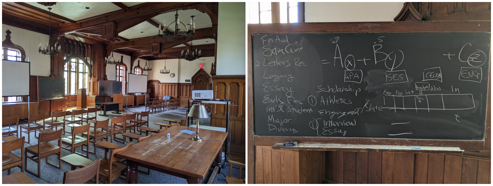
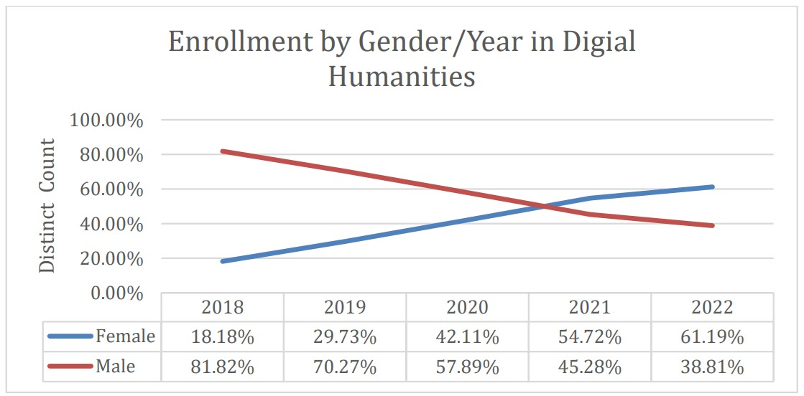

<h1><b>AI Digital Humanities</b></h1>
Jon A Chun 
Co-Founder, Kenyon DH Colab
  

 &nbsp; 

**Contents (UPDATED July 2024, see <a href="https://jonachun.com/">www.jonachun.com</a> for archive 2023 information)**
- [Overview](#overview)
- [Research](#research)
- [Innovation in Higher Ed](#innovation-in-higher-ed)
- [Diversity from A Human-Centered AI Curriculum](#diversity-from-a-human-centered-ai-curriculum)
- [Code, Products and Patents](#code-products-and-patents)
- [Kenyon AI Digital Humanities](#kenyon-ai-digital-humanities)
- [Social Media](#-social-media)
- [Mentored Research](#mentored-research)
- [Course Descriptions](#course-descriptions)
- [Organizations](#organizations)

  

## Overview
---

Here's a professionally refined version with minimal revisions:

I am an interdisciplinary ML/AI researcher and educator specializing in bridging traditional academic divisions, AI research, industry practices, and emerging social topics including government regulation, ethics, and entrepreneurship. My research focuses on ML/AI approaches to language, narrative, emotion, cognition, and persuasion/deception, employing data science, statistical machine learning, and deep learning including NLP, LLM, and LMM. My work extends to eXplainable AI (XAI), fairness-accuracy-transparency-explainability (FATE), AI ethical auditing, and AI regulation.

As an entrepreneur and innovator, I've contributed to diverse fields from network security and education to finance, insurance, and healthcare across environments ranging from Silicon Valley startups to higher education institutions. I've published pioneering interdisciplinary AI research on storytelling and emotion in major venues including Narrative and the Modern Language Association (MLA). In 2016, I co-founded the first human-centered AI curriculum integrating domain experts from literature, music, political science, and economics. We established the term 'AI Digital Humanities' and have guided approximately 400 ML/AI DH projects, achieving over 65,000 downloads from leading institutions worldwide. Currently, I serve as a co-principal investigator for the US NIST AI Safety Institute representing the Modern Language Association and collaborate with the IBM-Notre Dame Tech Ethics Lab researching LLM prediction capabilities.

My prior experience includes co-founding the world's largest privacy and anonymity website, backed by In-Q-Tel. As CEO, I led a successful company pivot, co-authored patents on the first browser-based VPN appliance, and navigated the acquisition by Symantec, where I later directed the product's successful relaunch. Previously, I served as CIO for Silicon Valley's premier return-to-work firm and as CTO for international startups in Latin America and Japan. During medical school, I was an American Heart Association research fellow, publishing on gene therapy and pioneering web-based EMR systems in the American Medical Informatics Journal. My early career included roles as DELL's first US-based Japanese localization engineer, SEMATECH's initial Japanese patent analyst, and positions in Tokyo financial reporting, Lawrence Berkeley Labs' synchrotron facility (ALS), and Computer Associates' aerospace IT division.

Languages: English (native), Spanish (US Foreign Service Exam certified), Japanese (JLPT certified), French (professional working proficiency)

Professional interests: AI advancement, collaborative innovation, creative engineering, functional design, technical presentations, and enterprise solutions. Previous leadership experience includes coaching roles in baseball, soccer, wrestling, robotics, and Destination Imagination.

## Research
---

My interdisciplinary research spans multiple domains, combining technical innovation with practical applications across various fields:

Early Career & Industry:
- Conducted research at Lawrence Berkeley Labs' Advanced Light Source Lab as an undergraduate researcher
- Served as a semiconductor research analyst for SEMATECH, leveraging Japanese language skills during graduate studies
- Co-authored genomics and medical informatics papers during medical school

Entrepreneurship & Innovation:
- Co-founded a successful Silicon Valley startup, later acquired by a leading global security company
- Co-inventor on several VPN patents focusing on network security and anonymity

Academic Leadership & AI Research:
- Pioneer in human-centered AI education, co-founding one of the world's first AI Digital Humanities Colabs in the early 2010s
- Published research in premier venues across AI, Computer Science, and Humanities:
  - Machine Learning: International Conference on Machine Learning (ICML)
  - Computational Linguistics: ACL's EMNLP/CoNLL
  - Computer Science: Frontiers in Computer Science
  - Humanities: Modern Language Association, Narrative
  - Digital Humanities: Springer International Journal of Digital Humanities, International Journal of Humanities and Arts Computing

I created the open-source library SentimentArcs in 2019, at the time the largest ensemble for diachronic sentiment analysis and the basis for Katherine Elkins's “The Shapes of Stories” (Cambridge UP 2022). I presented some of the earliest GPT-2 story generation work at Narrative2020 and have since published in Cultural Analytics and Narrative on AI and narrative. As of January 2025, I've mentored approximately four hundred computational Digital Humanities projects since 2017 across virtually every department of Kenyon College as part of the Integrated Program for Humane Studies and the Scientific Computing programs. I co-founded the AI Digital Humanities Colab, the world's first human-centered AI Digital Humanities curriculum at Kenyon, and our AI KDH research colab. I currently have research papers pending on using LLMs to compare multiple translations of Proust, multimodal (dialog+image) diachronic sentiment arcs in film, emotional hacking of LLM high-stakes decision-making, a novel benchmark on semantic similarity, IP infringement and creativity using Narrative theory, and an updated and expanding ethical audit of the leading LLMs. I'm also a co-author on an ICML position paper that was invited as an oral presentation this year in Vienna. My current research projects focus on AI persuasion, manipulation and deception as well as using LLMs for predictive analytics and decision-making on structured tabular data. (July 2024)

* Google Scholar: [jonchun2000](https://scholar.google.com/citations?user=l-iUHQMAAAAJ&hl=en)
* Academia.edu: [kenyon.academia.edu/jchun](https://kenyon.academia.edu/jchun)
* Following: [ArXiv CS.(x)](https://jon-chun.github.io/MyArXiv/)

<b>Recent Highlights</b>

* <a href="https://techethicslab.nd.edu/call-for-proposals/">"How Well Can GenAI Predict Human Behavior? Auditing State-of-the-Art Large Language Models for Fairness, Accuracy, Transparency, and Explainability (FATE)"</a>
* IBM-Notre Dame Tech Ethics Lab Grant (paper forthcoming)
  
This research project targets a pivotal issue at the intersection of technology and ethics: surfacing how Large Language Models (LLMs) reason in high-stakes decision-making over humans. Our central challenge is enhancing the explainability and transparency of opaque black-box LLMs and our specific use-case is predicting recidivism—a real-world application that influences sentencing, bail, and early release decision. To the best of our knowledge, this is the first study to integrate and contrast three different sources of ethical decision: human, statistical machine learning (ML), and LLMs. Methodologically, we propose a novel framework that combines state-of-the-art (SOTA) qualitative analyses of LLMs with SOTA quantitative performance of traditional statistical ML models. Additionally, we compare these two approaches with documented predictions by human experts. This multi-model human-AI approach aims to surface both faulty predictions across all three as well as correlate patterns of both valid and faulty reasoning by LLMs. This configuration offers a more comprehensive evaluation of their performance, fairness, and reliability that is essential for building trust in LLMs. The anticipated outcomes of our project include a test pipeline to analyze and identify discrepancies and edge cases in both predictions and the reasoning behind them. This pipeline includes automated API scripts, an array of simple to complex prompt engineering strategies, and well as various statistical analyses and visualizations. The pipeline architecture will be designed to generalize to other use cases and accommodate future models and prompt strategies to provide maximal reuse for the AI safety community and future studies. This project not only seeks to advance the field of XAI but also to foster a deeper understanding of how AI can be aligned with ethical principles. By highlighting the intricacies of AI decision-making in a context fraught with moral implications, we underscore the urgent need for models that are not only technologically advanced but also ethically sound and transparent.

* "ESP-Ethical Audit: An Ethical Alignment Audit to Quantify Biased Decision-Making with Emotion and Syntactic Framing"
* (Springer Discovery AI, In Review)

Autonomous agents and distributed AI networks are beginning to assist and even make decisions in real-world scenarios ranging from smart cities to HR. Ethical assessments are more urgent than ever, and our framework, ESP-Ethical Audit, offers a novel way to assess both strengths and vulnerabilities in current LLM systems. To date, there is surprisingly little quantitative assessment of underlying “ethical belief” systems in LLMs. This type of assessment samples the distribution of a binary classification task when LLMs are presented with complex and ethically-fraught scenarios. We interrogate whether decision-making by leading commercial and open-source LLM models align with human values and if so, whether that alignment reveals biases that typically occur in human decision-making. ESP-Ethical Audit measures confidence levels and explanatory frameworks across a variety of moral scenarios while testing perturbations along two dimensions: syntactic framing and empathic backstory. The former tests whether syntactic framing surfaces biases that mirror common framing biases documented in humans. The latter tests variations in backstory--both positive and negative--within two different relevancy scenarios. The first framework tests the introduction of facts that might be considered allowable in a US court of law; the other tests backstories that rely on emotional appeal.  In all three framing cases, whether syntactic or backstory, we find more performant models more closely mirror human biases and exhibit common shifts in decision-making. Our audit raises important safety concerns: continued AI progress in both performance and human-machine value alignment may also increase security issues related to persuasion, manipulation, and deception.

* <a href="https://arxiv.org](https://arxiv.org/abs/2410.21279">"Comparative Global AI Regulation: Policy Perspectives from the EU, China, and the US"</a>
* SSRN and ArXiv

As a powerful and rapidly advancing dual-use technology, AI offers both immense benefits and worrisome risks. In response, governing bodies around the world are developing a range of regulatory AI laws and policies. This paper compares three distinct approaches taken by the EU, China and the US. Within the US, we explore AI regulation at both the federal and state level, with a focus on California's pending Senate Bill 1047. Each regulatory system reflects distinct cultural, political and economic perspectives. Each also highlights differing regional perspectives on regulatory risk-benefit tradeoffs, with divergent judgments on the balance between safety versus innovation and cooperation versus competition. Finally, differences between regulatory frameworks reflect contrastive stances in regards to trust in centralized authority versus trust in a more decentralized free market of self-interested stakeholders. Taken together, these varied approaches to AI innovation and regulation influence each other, the broader international community, and the future of AI regulation.

* <a href="https://aclanthology.org/2024.conll-1.13/">"AIStorySimilarity: Quantifying Story Similarity Using Narrative for Search, IP Infringement, and Guided Creativity"</a>
* ACL EMNLP/CoNLL, Miami (12-16 November 2024)

Stories are central for interpreting experiences, communicating and influencing each other via films, medical, media, and other narratives. Quantifying the similarity between stories has numerous applications including detecting IP infringement, detecting hallucinations, search/recommendation engines, and guiding human-AI collaborations. Despite this, traditional NLP text similarity metrics are limited to short text distance metrics like n-gram overlaps and embeddings. Larger texts require preprocessing with significant information loss through paraphrasing or multi-step decomposition. This paper introduces AIStorySimiliarity, a novel benchmark to measure the semantic distance between long-text stories based on core structural elements drawn from narrative theory and script writing. Based on four narrative elements (characters, plot, setting, and themes) as well 31 sub-features within these, we use a SOTA LLM (gpt-3.5-turbo) to extract and evaluate the semantic similarity of of diverse set of major Hollywood movies. In addition, we compare human evaluation with story similarity scores computed three ways: extracting elements from film scripts before evaluation (Elements), directly evaluating entire scripts (Scripts), and extracting narrative elements from the parametric memory of SOTA LLMs without any provided scripts (GenAI). To the best of our knowledge, AIStorySimilarity is the first benchmark to measure long-text story similarity using a comprehensive approach to narrative theory. Code and data are available at https://github.com/anon.

* <a href="https://www.frontiersin.org/journals/computer-science/articles/10.3389/fcomp.2024.1444549/full">"Affective AI, Multimodal Sentiment Analysis, Diachronic Sentiment Analysis, Open-Source AI, LLM, LMM, Narrative, Storytelling, Video Analysis"</a>
* Frontiers in Computer Science

Affective artificial intelligence and multimodal sentiment analysis play critical roles in designing safe and effective human-computer interactions and are in diverse applications ranging from social chatbots to eldercare robots. However emotionally intelligent artificial intelligence can also manipulate, persuade, and otherwise compromise human autonomy. We face a constant stream of ever more capable models that can better understand nuanced, complex, and interrelated sentiments across different modalities including text, vision, and speech. This paper introduces MultiSentimentArcs, combination of an open and extensible multimodal sentiment analysis framework, a challenging movie dataset, and a novel benchmark. This enables the quantitative and qualitative identification, comparison, and prioritization of conflicting sentiments commonly arising from different models and modalities. Diachronic multimodal sentiment analysis is especially challenging in film narratives where actors, directors, cinematographers and editors use dialog, characters, and other elements in contradiction with each other to accentuate dramatic tension. MultiSentimentArcs uses local open-source software models to democratize artificial intelligence. We demonstrate how a simple 2-step pipeline of specialized open-source software with a large multimodal model followed by a large language model can approximate video sentiment analysis of a commercial state-of-the-art Claude 3 Opus. To the best of our knowledge, MultiSentimentArcs is the first fully open-source diachronic multimodal sentiment analysis framework, dataset, and benchmark to enable automatic or human-in-the-loop exploration, analysis, and critique of multimodal sentiment analysis on long-form narratives. We demonstrate two novel coherence metrics and a methodology to identify, quantify, and explain real-world sentiment models and modalities. MultiSentimentArcs integrates artificial intelligence with traditional narrative studies and related fields like film, linguistic and cultural studies. It also contributes to eXplainable artificial intelligence and artificial intelligence safety by enhancing artificial intelligence transparency in surfacing emotional persuasion, manipulation, and deception techniques. Finally, it can filter noisy emotional input and prioritize information rich channels to build more performant real-world human computer interface applications in fields like e-learning and medicine. This research contributes to the field of Digital Humanities by giving non-artificial intelligence experts access to directly engage in analysis and critique of research around affective artificial intelligence and human-AI alignment. Code and non-copyrighted data will be available at https://github.com/jon-chun/multisentimentarcs.

* <a href="https://www.frontiersin.org/journals/computer-science/articles/10.3389/fcomp.2024.1444021/full">"In search of a translator: using AI to evaluate what's lost in translation"</a>
* Frontiers in Computer Science, 12 August 2024, Sec. Human-Media Interaction, Volume 6 - 2024 | https://doi.org/10.3389/fcomp.2024.1444021 (Credited in Paper)

Machine translation metrics often fall short in capturing the challenges of literary translation in which translators play a creative role. Large Language Models (LLMs) like GPT4o and Mistral offer new approaches to assessing how well a translation mirrors the reading experience from one language to another. Our case study focuses on the first volume of Marcel Proust's “A la recherche du temps perdu,” a work known for its lively translation debates. We use stylometry and emotional arc leveraging the newest multilingual generative AI models to evaluate loss in translation according to different translation theories. AI analysis reveals previously undertheorized aspects of translation. Notably, we uncover changes in authorial style and the evolution of sentiment language over time. Our study demonstrates that AI-driven approaches leveraging advanced LLMs yield new perspectives on literary translation assessment. These methods offer insight into the creative choices made by translators and open up new avenues for understanding the complexities of translating literary works.

* <a href="https://arxiv.org/abs/2404.17047">"Near to Mid-term Risks and Opportunities of Open-Source Generative AI"</a> ICLR 2024, May 7-11, Vienna, Austria
* <a href="https://arxiv.org/abs/2405.08597">"Risks and Opportunities of Open-Source Generative AI"</a> (Long form version)

In the next few years, applications of Generative AI are expected to revolutionize a number of different areas, ranging from science & medicine to education. The potential for these seismic changes has triggered a lively debate about potential risks and resulted in calls for tighter regulation, in particular from some of the major tech companies who are leading in AI development. This regulation is likely to put at risk the budding field of open source Generative AI. We argue for the responsible open sourcing of generative AI models in the near and medium term. To set the stage, we first introduce an AI openness taxonomy system and apply it to 40 current large language models. We then outline differential benefits and risks of open versus closed source AI and present potential risk mitigation, ranging from best practices to calls for technical and scientific contributions. We hope that this report will add a much needed missing voice to the current public discourse on near to mid-term AI safety and other societal impact.

* <a ref="https://arxiv.org/pdf/2402.01651">"Informed AI Regulation: Comparing the Ethical Frameworks of Leading LLM Chatbots Using an Ethics-Based Audit to Assess Moral Reasoning and Normative Values"</a>
* ArXiv.org (Jan 9, 2024)

With the rise of individual and collaborative networks of autonomous agents, AI is deployed in more key reasoning and decision-making roles. For this reason, ethics-based audits play a
pivotal role in the rapidly growing fields of AI safety and regulation. This paper undertakes an ethics-based audit to probe the 8 leading commercial and open-source Large Language Models including GPT-4. We assess explicability and trustworthiness by a) establishing how well different models engage in moral reasoning and b) comparing normative values underlying models as ethical frameworks. We employ an experimental, evidence-based approach that challenges the models with ethical dilemmas in order to probe human-AI alignment. The ethical scenarios are designed to require a decision in which the particulars of the situation may or may not necessitate deviating from normative ethical principles. A sophisticated ethical framework was consistently elicited in one model, GPT-4. Nonetheless, troubling findings include underlying normative frameworks with clear bias towards particular cultural norms. Many models also exhibit disturbing authoritarian tendencies. Code is available at https://github.com/jonchun/llm-sota-chatbots-ethics-based-audit.

* <a ref="https://link.springer.com/article/10.1007/s42803-023-00069-8">"eXplainable AI with GPT4 for story analysis and generation: A novel framework for diachronic sentiment analysis"</a>
* Springer International Journal of Digital Humanities 5, 507–532 (2023). https://doi.org/10.1007/s42803-023-00069-8 (Oct 11, 2023)
  
The recent development of Transformers and large language models (LLMs) offer unique opportunities to work with natural language. They bring a degree of understanding and fluidity far surpassing previous language models, and they are rapidly progressing. They excel at representing and interpreting ideas and experiences that involve complex and subtle language and are therefore ideal for Computational Digital Humanities research. This paper briefly surveys how XAI can be used to augment two Computational Digital Humanities research areas relying on LLMs: (a) diachronic text sentiment analysis and (b) narrative generation. We also introduce a novel XAI greybox ensemble for diachronic sentiment analysis generalizable to any AI classification data points within a structured time series. Under human-in-the-loop supervision (HITL), this greybox ensemble combines the high performance of SOTA blackbox models like gpt-4–0613 with the interpretability, efficiency, and privacy-preserving nature of whitebox models. Two new local (EPC) and global (ECC) metrics enable multi-scale XAI at both the local and global levels. This greybox ensemble framework extends the SentimentArcs framework with OpenAI’s latest GPT models, new metrics and a modified supervisory HITL workflow released as open source software at https://github.com/jon-chun/SentimentArcs-Greybox.

* <a href="https://www.euppublishing.com/doi/abs/10.3366/ijhac.2023.0310?journalCode=ijhac">"The Crisis of Artificial Intelligence: A New Digital Humanities Curriculum for Human-Centred AI"</a>
* International Journal of Humanities and Arts Computing

This article outlines what a successful artificial intelligence digital humanities (AI DH) curriculum entails and why it is so critical now. Artificial intelligence is rapidly reshaping our world and is poised to exacerbate long-standing crises including (1) the crisis of higher education and the humanities, (2) the lack of diversity, equity and inclusion (DEI) in computer science and technology fields and (3) the wider social and economic crises facilitated by new technologies. We outline a number of ways in which an AI DH curriculum offers concrete and impactful responses to these many crises. AI DH yields meaningful new avenues of research for the humanities and the humanistic social sciences, and offers new ways that higher education can better prepare students for the world into which they graduate. DEI metrics show how an AI DH curriculum can engage students traditionally underserved by conventional STEM courses. Finally, AI DH educates all students for civic engagement in order to address both the social and economic impacts of emerging AI technologies. This article provides an overview of an AI DH curriculum, the motivating theory behind design decisions, and a detailed look into two sample courses.

* <a href="https://www.academia.edu/98342630/Narrative_2023_Program?auto=download">"How to Identify, Understand, and Analyze ChatGPT AI Narratives"</a> with <a href="https://www.slideshare.net/slideshow/how_to_identify_understand_and_analyze_c-pptx/270858290">Slides</a>
* Narrative 2023, March 1-4th, Dallas, TX

* "Augmenting Narrative Generation with Visual Imagery Using Integrated Prompt Engineering (ChatGPT, DALL-E 2)"
* Narrative 2023, March 1-4th, Dallas, TX -[Narrative Society](https://www.thenarrativesociety.org/2023-conference)

* Roundtable: <a href="https://github.com/jon-chun/generative_ai_roundtable">"Generative AI Art and Writing: ChatGPT and Generative AI Art: How it Works, Where It's Going, and What It Means for Our Future"</a>
* (video and links to generative AI resources), 17th January 2023, AI DHColab, Kenyon College, Gambier, OH

* <a href="https://www.helixcenter.org/roundtables/living-in-difficult-times/">Living In Difficult Times</a>
* The Helix Center, Nov 19th, 2022, NY, NY

* Chun, Jon, and Katherine Elkins. <a href="https://muse.jhu.edu/article/846035">"What the Rise of AI Means for Narrative Studies: A Response to “Why Computers Will Never Read (or Write) Literature” by Angus Fletcher."</a>
* Narrative 30, no. 1 (2022): 104-113. doi:10.1353/nar.2022.0005.

* Chun, Jon. <a href="https://arxiv.org/abs/2110.09454">"SentimentArcs: A Novel Method for Self-Supervised Sentiment Analysis of Time Series Shows SOTA Transformers Can Struggle Finding Narrative Arcs."</a> \
* ArXiv abs/2110.09454 (2021): n. page.

SOTA Transformer and DNN short text sentiment classifiers report over 97% accuracy on narrow domains like IMDB movie reviews. Real-world performance is significantly lower because traditional models overfit benchmarks and generalize poorly to different or more open domain texts. This paper introduces SentimentArcs, a new self-supervised time series sentiment analysis methodology that addresses the two main limitations of traditional supervised sentiment analysis: limited labeled training datasets and poor generalization. A large ensemble of diverse models provides a synthetic ground truth for self-supervised learning. Novel metrics jointly optimize an exhaustive search across every possible corpus:model combination. The joint optimization over both the corpus and model solves the generalization problem. Simple visualizations exploit the temporal structure in narratives so domain experts can quickly spot trends, identify key features, and note anomalies over hundreds of arcs and millions of data points. To our knowledge, this is the first self-supervised method for time series sentiment analysis and the largest survey directly comparing real-world model performance on long-form narratives.
  
* Chun, Jon. <a href="https://www.youtube.com/watch?v=Ldb0vlCQXtQ&t=1s">AI Improv DivaBot</a> in collaboration with Katherine Elkins, James Dennen (Denison University and Wexner Arts), Lauren Katz (Thymele Arts, LA), ***100th anniversary of the premiere of “R.U.R.,” by Czechoslovakian playwright Karel Capek. “R.U.R.”*** (for “Rossum’s Universal Robots”) opened on January 25th, 1921, at the National Theater of Prague and marks the first use of the word “robot,” coined by Capek and derived from the Czech word for “forced labor.”, 25 Jan 2021

* Elkins, Katherine, and Jon Chun. <a href="https://culturalanalytics.org/article/17212.pdf">"Can GPT-3 pass a Writer’s Turing Test?."</a> Journal of Cultural Analytics 5, no. 2 (2020): 17212.

Until recently the field of natural language generation relied upon formalized grammar systems, small-scale statistical models, and lengthy sets of heuristic rules. This older technology was fairly limited and brittle: it could remix language into word salad poems or chat with humans within narrowly defined topics. Recently, very large-scale statistical language models have dramatically advanced the field, and GPT-3 is just one example. It can internalize the rules of language without explicit programming or rules. Instead, much like a human child, GPT-3 learns language through repeated exposure, albeit on a much larger scale. Without explicit rules, it can sometimes fail at the simplest of linguistic tasks, but it can also excel at more difficult ones like imitating an author or waxing philosophical.

* (AI Story Generation / AI Narrative Generation) <a href="https://github.com/jon-chun/conference-narrative2020-GPT2-NLG">How Artificial Intelligence Tells Stories: Natural Language Generation and Narrative</a>, Narrative 2020 Conference (page 28), March 5-7 The Intercontinental Hotel, New Orleans
  
  

<figure>

<figcaption align = "center"><i>SentimentArcs is the open-source code for <a href="https://www.amazon.com/Stories-Elements-Digital-Literary-Studies/dp/1009270397">The Shapes of Stories</a></i> by Katherine Elkins (Cambridge Press, Aug 2022) </figcaption>
</figure>

Sentiment analysis has gained widespread adoption in many fields, but not―until now―in literary studies. Scholars have lacked a robust methodology that adapts the tool to the skills and questions central to literary scholars. Also lacking has been quantitative data to help the scholar choose between the many models. Which model is best for which narrative, and why? By comparing over three dozen models, including the latest Deep Learning AI, the author details how to choose the correct model―or set of models―depending on the unique affective fingerprint of a narrative. The author also demonstrates how to combine a clustered close reading of textual cruxes in order to interpret a narrative. By analyzing a diverse and cross-cultural range of texts in a series of case studies, the Element highlights new insights into the many shapes of stories.
  

[Back to Top](#ai-digital-humanities)

  

## Innovation in Higher Ed
---
I creatively apply the best of industry practices and state-of-the-art AI/ML techniques on interesting and high-impact interdisciplinary research. The combination of AI/ML, math/statistics and a diversity of domain expertise provides fresh insights and countless new paths of discovery.

I've also long been interested in bringing diverse voices to urgent debates surrounding technology’s growing impact on society. Our AI Digital Humanities computing curriculum has succeeded in attracting a majority female (61%), non-STEM (91%) and Under-Represented Minorities (11% Hispanic, 13% Black) as of 2022. Enrollments have steadily grown to become one of the most popular courses on campus. Both our research and that of our students have seen exponential growth in terms of citations and thousands of visits from top academic institutions around the world.

Over most of the last decade, I have been developing a new human-first approach to teaching computation grounded in ML, AI and Data Science with real-world applications inseparable from ethics. One challenge was to bridge the STEM and non-STEM divide. Another challenge was harmonizing the rigorous specialization of academia with practical, interdisciplinary and generalizable real-world solutions. The final challenge was to bootstrap an entirely new AI Digital Humanities computing curriculum without a budget, support staff, or academic credit toward any major/minor.

Over the first 6 years, our foundational course has become one of the most popular on campus. Both our professors' and students' research have been published in top journals, presented at leading conferences and have been read by tens thousands from top universities and research centers around the world. Both founders of our program have been involved in several organizations beyond Kenyon dedicated to AI, Ethics and innovating CS Education.

Philosophically, my goal is to cultivate in students a technologically informed worldview grounded in universal humanistic values. This integrated worldview is designed to intimately align the core strengths of traditional education with more ethical, practical and beneficial uses of technology for all.

  

[Back to Top](#ai-digital-humanities)

  

## Diversity from A Human-Centered AI Curriculum
---

  <figure>

<figcaption align = "center"><b>UPDATE:</b> <i>Progress on UMR Diversity</i> </figcaption>
</figure>

 
<b>Fall 2022</b> <i>IPHS 200 Programming Humanity (estimate)</i>

| Category | Count | Percent |
| -------- | ----- | ------- |
| Male | 41 | 53% |
| Female | 36 | 47% |
| TOTAL | 78 | 100% |
* 13% African-American (10)

  
---
<figure>

<figcaption align = "center"><i>Progress on Gender Diversity in AI Digital Humanities curriculum since the 2017-2018 academic year (61% female as of Spring 2022)</figcaption>
</figure>

  

At Kenyon College, I co-founded the world’s first human-centric AI curriculum. I am the sole technical advisor and the primary collaborative content creator. Over the last six years of teaching this curriculum, we have achieved the following milestones:

• <b>Research:</b> Published research in top publications and conferences (Cambridge UP, Narrative, Journal of Cultural Analytics, etc.) with clear growth in citations.

• <b>AI Digital Humanities/DH Colab Research:</b> Organically grew (no marketing/PR) to ~15k hits from top universities worldwide (#4 CMU, #5 Berkeley, #6 Stanford, #7 Columbia, #9 NYU, #16 Princeton, #22 Oxford, #23 MIT, #25 Cambridge, etc.)

• <b>Diversity:</b> 
  * <b>Female</b> Grew from 18% to 61% between 2017-2021 
  * <b>Hispanic</b> participation rates are often at or above college averages
  * <b>Black</b> 13% (Fall 2022 estimate above) 
  * <b>Non-STEM</b> Our classes are ~90% non-STEM from across nearly all departments, enfranchising many students who may otherwise feel alienated by traditional CS programs
  * <b>100%</b> Pass rate (Quality of student work independently confirmed by success of their research archive at digital.kenyon.edu/dh)
  * <b>0%</b> Drop rate
    
• <b>Enrollment:</b> Experienced enrollment growth from 20 to 120 between 2017-2022 becoming one of the largest classes at Kenyon as an elective with no credit toward the traditional STEM computing major/minor

• <b>Budget:</b> With no budget or antecedent, innovated from scratch a globally recognized computational DH Colab research center and AI Digital Humanities. This includes no funds for hardware, software, cloud computing, support staff or other common expenses. This is achieved thru continual strategic planning, careful curation and testing fully open-source, robust, best-of-breed and/or freely available resources informed by decades of experience in industry.

Our interdisciplinary AI DH research has been published in top presses, journals, and conferences. We have also mentored hundreds of ML/AI DH projects that synthesize Artificial Intelligence with literature, history, political science, art, dance, music, law, medicine, economics and more. Various sample AI DH projects are given at the bottom of this page.

<b>Timeline</b>

* **1992-99**: The <a href="https://www.kenyon.edu/academics/departments-and-majors/integrated-program-in-humane-studies/">*Integrated Program for Humane Studies*</a> (IPHS, the oldest interdisciplinary program at Kenyon) established a computer lab in Timberlake House for DH scholarship under Director Michael Brint
* **2002 Jul**: Katherine Elkins joined Kenyon and began mentoring traditional Digital Humanities projects (e.g. critiques of technology, websites, media, etc.) in the IPHS program
* **2003 May**: Launched product Symantec Clientless VPN appliance as Director of Development and relocated from Silicon Valley
* **2005 Mar**: Proposed new humanity-centered AI Digital Humanities curriculum in conjunction with a multi-million <a href="https://philanthropynewsdigest.org/news/morgan-kauffman-foundations-launch-liberal-arts-entrepreneurship-initiative">Ewing Marion Kauffman Foundation</a> grant
* **2015 Aug**: Formulated detailed interdisciplinary AI Digital Humanities curriculum after years of research and training
* **2017 Mar**: Lead DH Kenyon Team at the <a href="https://hackoh5.ohio5.org/">HackOH5</a> Hackathon to explore challenges and opportunities in implementing computational Digital Humanities and effecting collaboration across disciplines
* **2017 Aug**: Kenyon supports the first <a href="https://digital.kenyon.edu/dh_iphs_prog/">'*Programming Humanity*'</a> course co-taught with a Humanities and Comparative Literature professor.
* **2018 Aug**: Kenyon adds first <a href="https://digital.kenyon.edu/dh_iphs_ai/">'*AI for the Humanities*'</a> course with a differentiated approach to GOFAI/ML through DNN, RL, and GA
* **2018 Aug**: Katherine Elkins awarded a multi-year <a href="https://www.kenyon.edu/offices-and-services/office-of-the-provost/recognition/neh-professorship/">National Endowment of the Humanities Distinguished Professorship</a> to continue developing a campus-wide Digital Humanities program to include every interested department
* **2022 Jan**: Collaboration with <a href="https://cs.kenyon.edu/index.php/scmp-401-scientific-computing-seminar/">*Scientific Computing program at Kenyon*</a> mentoring several majors on interdisciplinary research  
* **2022 Aug**: Kenyon offers first computational <a href="https://jon-chun.github.io/cultural-analytics/">'*Cultural Analytics*'</a> DH methodology course for Social Sciences and Humanities 
* **2022 Aug**: First collaboration with local industry via <a href="https://github.com/jon-chun/iiot-time-series-prediction-system">'*Industrial IoT Independent Study*'</a> targeting technical reference implementation and strategic whitepaper
* **2023**: Join Meta Global Scholars Reearch Group and co-publish multiple papers with collaborators from Oxford, UC Berkeley, Notre Dame, University of Virginia, etc.
* **2024**: Co-Principle Investigator for the Modern Language Institute's team for the <a href="https://www.nist.gov/aisi/artificial-intelligence-safety-institute-consortium/aisic-members">NIST AI Safety Institute Consortium</a> created by <a href="https://www.whitehouse.gov/briefing-room/presidential-actions/2023/10/30/executive-order-on-the-safe-secure-and-trustworthy-development-and-use-of-artificial-intelligence/">Whitehouse Exectuive Order "Executive Order on the Safe, Secure, and Trustworthy Development and Use of Artificial Intelligenc"</a>
* **2024**: Co-Principle Investigator for the IBM-Notre Dame Tech Ethics Grant: <a href="https://techethicslab.nd.edu/news/notre-dameibm-technology-ethics-lab-awards-more-than-900-000-to-support-collaborative-research-projects-between-teams-of-notre-dame-faculty-and-international-scholars/>How Well Can GenAI Predict Human Behavior? Auditing State-of-the-Art Large Language Models for Fairness, Accuracy, Transparency, and Explainability (FATE)</a>

  

<figure>

<figcaption align = "center"> <i>Kenyon College's <a href="https://www.kenyon.edu/offices-and-services/office-of-the-provost/recognition/neh-professorship/">The National Endowment for the Humanities Professorship</a></i> </figcaption>
</figure>

  

Our AI research and DHColab were collaboratively developed, and the curriculum is currently co-taught by a technology expert (Jon Chun) and an accomplished academic (Katherine Elkins). Both have broad experiences, publications, and interests transcending traditional domain boundaries. Support was provided with a ***3-year National Endowment for the Humanities (NEH) appointment*** described here.

  

<figure>

<figcaption align = "center"> <i>Collaborator Katherine Elkins work as <a href="https://www.kenyon.edu/offices-and-services/office-of-the-provost/recognition/neh-professorship/">Kenyon College's National Endowment for the Humanities Professorship</a></i> </figcaption>
</figure>

  

<figure>

<figcaption align = "center"> <i>A Humanity-First approach to AI Digital Humanities consistently attracts over 90% non-STEM majors (Kenyon College Institutional Research)</a></i> </figcaption>
</figure>

  

[Back to Top](#ai-digital-humanities)

  

## Code, Products and Patents
---
* SentimentArcs: [Github Repo](https://github.com/jon-chun/sentimentarcs_notebooks)
* GitHub: [jon-chun](https://github.com/jon-chun)
* SafeWeb: [SEA Tsunami Products](https://drive.google.com/drive/folders/1ZhQzKM5i6ZnHGmhTphs6Vq2uBTw4jchx?usp=sharing)
* Patents: [SEA Tsumani](https://drive.google.com/drive/folders/15UPcgB-SfwiUBers10c3qpMAB_bF0BJL?usp=sharing)
  
  

<figure>

<figcaption align = "center"> <i>Block Diagram for  <a href="https://github.com/jon-chun/sentimentarcs_notebooks">SentimentArcs Notebooks</a></i> </figcaption>
</figure>

Stories are everywhere. Here are a few examples of original research projects using SentimentArcs to extract and analyze narrative emotional arcs in:
* Literature: <a href="https://digital.kenyon.edu/dh_iphs_ai/12/">Doubles and Reflections: Sentiment Analysis and Vladimir Nabokov’s Pale Fire</a>
* Translations: <a href="https://digital.kenyon.edu/dh_iphs_prog/55/">The Trials of Translation: A Cross-Linguistic Survey of Sentiment Analysis on Franz Kafka’s Trial</a> 
* TV Scripts: <a href="https://digital.kenyon.edu/dh_iphs_ss/4/">Blood in the Water: Storytelling and Sentiment Analysis in ABC's Shark Tank</a>
* Medical End of Life Narratives: <a href="https://digital.kenyon.edu/dh_iphs_ss/20/">On Death and Emotion: Evaluating the Five Stages of Grief in End-of-Life Memoirs Using AI Deep Learning Models</a>
* Social Media (Government Collapse): <a href="https://digital.kenyon.edu/dh_iphs_prog/59/">How Did Sri Lankan Protestors End Up in the President’s Pool? Understanding the evolution of an occupy-style protest: A story of economic turmoil, declining social sentiment and resulting political change</a>
* Social Media (Elections): <a href="https://digital.kenyon.edu/dh_iphs_prog/66/">Quantifying Polarization around Election Denial: Measuring Public Sentiment Changes in the 2022 Midterms</a>

  

<figure>

<figcaption align = "center"> <i>Multimodal SentimentArcs: Royal Wedding (1951) Video 10% SMA Plot (2024)</figcaption>
</figure>

  

<figure>

<figcaption align = "center"> <i>Multimodal SentimentArcs: Royal Wedding (1951) Transcript 10% SMA Plot (2024)</figcaption>
</figure>

  

<figure>

<figcaption align = "center"> <i>Multimodal SentimentArcs: Royal Wedding (1951) KDE Plot (2024)</figcaption>
</figure>

[Back to Top](#ai-digital-humanities)

  

## Kenyon AI Digital Humanities
---
<figure>

<figcaption align = "center"> <i>Top 10 Institutions reading our AI DH Research in 2022 <a href="https://digital.kenyon.edu/dh/">digital.kenyon.edu/dh</a></i> </figcaption>

</figure>

  

* [AI/ML Digital Humanities Projects](https://digital.kenyon.edu/dh/)
* [Kenyon Digital Colab](https://www.kenyon.edu/digital-humanities/kdh-colab/)
* [Kenyon AI Digital Humanities](https://www.kenyon.edu/digital-humanities/)

  

<figure>

<figcaption align = "center"> <i>Leading Institutions reading our AI DH Research in 2022 <a href="https://digital.kenyon.edu/dh/">digital.kenyon.edu/dh</a></i> </figcaption>
</figure>

  

<figure>

<figcaption align = "center"> <i>Eurasian Institutions <a href="https://digital.kenyon.edu/dh/">digital.kenyon.edu/dh</a></i> </figcaption>
</figure>

  

<figure>

<figcaption align = "center"> <i>Institutions from The Americas <a href="https://digital.kenyon.edu/dh/">digital.kenyon.edu/dh</a></i> </figcaption>
</figure>

  

<figure>

<figcaption align = "center"> <i>Countries Worldwide <a href="https://digital.kenyon.edu/dh/">digital.kenyon.edu/dh</a></i> </figcaption>
</figure>

  

<figure>

<figcaption align = "center"> <i>Institutions Worldwide (2023 May) <a href="https://digital.kenyon.edu/dh/">digital.kenyon.edu/dh</a></i> </figcaption>
</figure>

  

images\kenyon_dh_analytics_institutions_1958.png

[Back to Top](#ai-digital-humanities)

  

## Social Media
---
  

<figure>

<figcaption align = "center"> <i><b>@jonchun2000</b> Main Social Media Account</i></figcaption>
</figure>

  

* Twitter: [@jonchun2000](https://twitter.com/jonchun2000)
* LinkedIn: [jonchun2000](https://www.linkedin.com/in/jonchun2000/)
* Instagram: [jonchun2000](https://www.instagram.com/jonchun2000/)

  

[Back to Top](#ai-digital-humanities)

  

## Mentored Research
---

<figure>

<figcaption align = "center"> <i>Brainstorming to translate new theories into testable models for (a) Literary Analysis, (b) Financial Forensics and (c) the Latent Space of Generative Art Prompts.</i></figcaption>
</figure>

  

<b>Integrated Program for Humane Studies (2017-)</b>

* <b>IPHS200 [Programming Humanity](https://digital.kenyon.edu/dh_iphs_prog/) (samples below)</b>

How do we think of humanity in the digital age? Can we program humanity into our technology by generating music, analyzing vast quantities of literary text, and producing great visual works of art? Or will humans be programmed through genetic engineering, predictive policing, manipulations of social media, and domestic surveillance? Are we firmly entrenched in a Posthumanist world, and is Transhumanism a future to which we should aspire? By the end of this course you will:

- Have basic skills in Python, data visualization, data wrangling, and natural language processing.
- Gain a foundational understanding of key aspects of our Age of Information from Dataism and Information Theory to Machine Learning and Artificial Intelligence.
- Relate this emerging picture to conversations about Humanism, Posthumanism, and Transhumanism.
- Understand how new computational tools both challenge and deepen traditional approaches to the Social Sciences, Humanities, and Fine Arts.
- Understand emerging ethical debates surrounding key technologies poised to transform humanity.
- Have a portfolio of project-based work demonstrating your computational skills with a final project of your choice.

**Sample Course Projects:**
  - Cultural Bias/DALL-E 2: [Adjectivally-Oriented: Women Through the Decades: Stylistic Shifts In Magazines As Represented By Image-Generating AI](https://digital.kenyon.edu/dh_iphs_prog/53)
  - Political Science/Social Media [How Did Sri Lankan Protestors End Up in the President’s Pool? Understanding the evolution of an occupy-style protest: A story of economic turmoil, declining social sentiment and resulting political change](https://digital.kenyon.edu/dh_iphs_prog/59)
  - Gender Studies/Topic Modeling: [The Second Meaning: Uncovering the Linguistic Interpretation of Simone de Beauvior’s The Second Sex](https://digital.kenyon.edu/dh_iphs_prog/52)
  - Literature/Multilingual Sentiment Analysis: [The Trials of Translation: A Cross-Linguistic Survey of Sentiment Analysis on Franz Kafka’s Trial](https://digital.kenyon.edu/dh_iphs_prog/55)
  - ChatGPT/Security: [Breaking ChatGPT with Dangerous Questions](https://digital.kenyon.edu/dh_iphs_prog/63)
  - Art Communities/DALL-E 2: [Do Andriods Dream of Digital Art? Addressing the Spectrum of Perspectives on AI-Generated Artwork](https://digital.kenyon.edu/dh_iphs_prog/61)
  - Economics/Social Media Sentiment: [How the Mighty Have Fallen: Analyzing Twitter Sentiment in the Wake of FTX Bankruptcy and Sam Bankman-Fried's Indictment](https://digital.kenyon.edu/dh_iphs_prog/60)
  - Literature/Spanish Sentiment Analysis: [Multilingual Sentiment Analysis and Translation: Spanish and English Story Arcs in Juan Rulfo’s Pedro Páramo](https://digital.kenyon.edu/dh_iphs_prog/56) 
  - Sociology/Social Media: [Understanding Caste System in Nepal: Surfacing changes in public sentiment on Twitter over time](https://digital.kenyon.edu/dh_iphs_prog/51)
  - Political Science/Economics [Military Expenditures and Terrorism: Assessing Correlation Between Terror Attacks and Global Military Spending](https://digital.kenyon.edu/dh_iphs_prog/58)
  - Literature/Sentiment Analysis [Hitchhiker's Guide to Sentiment Analysis: A Comparison between Movie and Film](https://digital.kenyon.edu/dh_iphs_prog/57)
  - Sports Economics/Social Media: [Values or Profit? An Analysis on the Impact of Legal Sports Betting on Sports Business](https://digital.kenyon.edu/dh_iphs_prog/50)
  - Environmental Studies/Social Media [Energy Conversation on Alternative Energy World Perspective vs Bangladesh](https://digital.kenyon.edu/dh_iphs_prog/54)
  - Political Science/Social Media [Understanding Public Opinion towards the Government of Bangladesh through Sentiment Analysis of Twitter](https://digital.kenyon.edu/dh_iphs_prog/62)
  - Poetry/GPT-3: [The GPT3 Re-Imagining of “Howl” By Allen Ginsberg: What Are The Strengths and Weaknesses of This Representation?](https://digital.kenyon.edu/dh_iphs_prog/30/)
  - Literature/GPT-2: [345M-GPT-2 After James Wright: Can AI Generate Convincing Contemporary Poetry?](https://digital.kenyon.edu/dh_iphs_prog/11/)
  - Environmental Studies/Bayesian Time Series Analysis: [Predicting Attitudes Toward the Environment Artificial Intelligence for the Humanities](https://digital.kenyon.edu/dh_iphs_ai/7/)
  - Political Science/NLP Topic Modeling: [Transitional Justice Terminology Analysis in United Nations General Assembly Speeches (1971-2015)](https://digital.kenyon.edu/dh_iphs_ai/1/)
  - Literature/NLP Sentiment Analysis [Doubles and Reflections: Sentiment Analysis and Vladimir Nabokov’s Pale Fire](https://digital.kenyon.edu/dh_iphs_ai/12/)
  - Conflict Studies/Data Science [Cold War Conflicts: Analyzing the Role of U.S. Arms Exports](https://digital.kenyon.edu/dh_iphs_ai/10/)
  - Music/RNN Composition: [RNN monophonic sheet music generation with LilyPond](https://digital.kenyon.edu/dh_iphs_ai/2/)
  - Political Science/Machine Learning[Freedom, Democracy, and Well-Being: A Comparative Analysis of Global Progress Indexes Using K-Means Clustering](https://digital.kenyon.edu/dh_iphs_ai/35/)
  - Environmental Studies/Machine Learning [LEED Certification Prediction with K-Means Clustering Algorithm](https://digital.kenyon.edu/dh_iphs_ai/3/) 
  - Economics/Time Series Forecasting: [Computational Approaches to Predicting Cryptocurrency Prices](https://digital.kenyon.edu/dh_iphs_ai/8/)
  - Film/NLG w/GPT-2: [Digitizing Camp: Training a GPT-2 on "The Rocky Horror Picture Show"](https://digital.kenyon.edu/dh_iphs_ai/25/)
  - Journalism/NLG 2/GPT-2: [GPT-2 Journalism: Can AI produce Mike Royko’s writing?](https://digital.kenyon.edu/dh_iphs_ai/30/)
  - Modern Language/NLP Analysis: [Lost in Translation: Using Sentiment Analysis to Analyze Translations of Homer’s Odyssey](https://digital.kenyon.edu/dh_iphs_ai/17/)
  - Music/Machine Learning Recommendation: [Analyzing popular music using Spotify’s Machine Learning Audio Features](https://digital.kenyon.edu/dh_iphs_ai/14/)
  - Political Science/Data Science: [COVID-19: Global Trends in Social Protection, Unemployment, and Economic Stimuli](https://digital.kenyon.edu/dh_iphs_prog/14/)
  - Social Sciences/NLP: [Building a Universal Human Trafficking Lexicon](https://digital.kenyon.edu/dh_iphs_prog/20/)
  - Law/NLP Topic Modeling: [Topic Modeling Analysis of Supreme Court Opinions Focusing on Privacy Rights in the Context of Abortion Law](https://digital.kenyon.edu/dh_iphs_ai/11/)
  - Philosophy/NLG w/GPT-3 Prompt Engineering: [Prompt Engineering Tips for Generating Text on Cognitive Science and Philosophy of Mind](https://digital.kenyon.edu/dh_iphs_ai/34/)
  - Political Science/Social Media NLP Sentiment Analysis: [Consequences of Social Network Architecture: Analyzing Sentiment in Reddit Posts About Donald Trump](https://digital.kenyon.edu/dh_iphs_ai/31/)
  - Film/GPT-2: [https://digital.kenyon.edu/dh_iphs_prog/19/](https://digital.kenyon.edu/dh_iphs_prog/19/)
  

* <b>IPHS290 [Cultural Analytics](https://jon-chun.github.io/cultural-analytics/) (New Fall 2022)</b>

IPHS290 Cultural Analytics explores advanced computational methods for cultural analytics, focusing on the analysis of complex composite data types including geospatial, time series, and network graphs. Building upon foundational programming knowledge, students learn specialized techniques for collecting, transforming, and visualizing unstructured and structured data to investigate contemporary and historical cultural phenomena. Through engagement with Digital Humanities scholarship and hands-on technical implementation, students develop expertise in analyzing spatially, temporally, and semantically correlated data. This course prepares researchers to expand their analytical capabilities beyond traditional structured datasets to encompass the full spectrum of cultural data analysis.

**Sample Course Projects:**
  - Sociology/Multi-Racial Identity
  - Medical Narratives/NLP Analysis of End-of-Life Medical Narratives 
  - Politcal Science/US-Latin American Geopolitical, Economic, & Military Aid and Analysis 
  - Literature/Exploring Representations of Utopia in Literature over Time
  - Finance/Analysis of Economic Performance and Healthcare Quality Metrics after Private Equity Acquisitions
  - Operational Research/Global Supply Chain Analysis post-Covid
  

* <b>IPHS300 [AI for the Humanities](https://digital.kenyon.edu/dh_iphs_ai/) (samples below)</b>

“Why isn’t AI a branch of mathematics?” Norvig and Russell ask in their seminal textbook Artificial Intelligence: A Modern Approach. “The first answer,” they explain, “is that AI from the start embraced the idea of duplicating human faculties such as creativity, self-improvement, and language use”(18).

We explore AI from this humanist perspective by building a foundation to understand the creativity, self-improvement and language at the core of the discipline. Our approach blends the conceptual with hands-on exploration and application. We think through the humanist-centered theory and practice of artificial intelligence and machine learning from a liberal arts perspective that is highly interdisciplinary in nature. To that end, the course will touch on domains intertwined with AI like cognitive science and language and linguistics.

Textual analysis will receive our major attention and will provide an ideal foundation for students interested in computational approaches to literature. However we will also explore a wide range of textual applications that will be of interest to a broader range of students: textual analytics that help us explore disciplines like economics, politics, sociology, cultural studies, and psychology. The last weeks of the course will move to image, video and sound by building on previous skills acquired from textual analysis.

**Sample Course Projects:**
  - Jewish Studies/Information Science: [Taxonomy Techniques for Holocaust-Related Image Digitization and Text](https://digital.kenyon.edu/dh_iphs_prog/21/)
  - Law: [Synthetic Biology: Analyzing Trends in Intellectual Property Rights vs. Open Access to Research, 1989-2019](https://digital.kenyon.edu/dh_iphs_prog/5/)
  - Asian-American Studies/Sentiment Analysis: [The Rise of Anti-Asian American Sentiment with COVID-19](https://digital.kenyon.edu/dh_iphs_prog/15/)
  - Gender Studies/Data Science: [TikTok’s Non-Inclusive Beauty Algorithm & Why We Should Care](https://digital.kenyon.edu/dh_iphs_prog/22/)
  - Literature/NLP Stylometrics: [Analyzing the Reading Levels of Fifty Shades of Grey and The DaVinci Code: Learning More About Blockbuster Books](https://digital.kenyon.edu/dh_iphs_prog/47/)
  - Conflict Studies/Data Science: [Does U.S. Conflict Intervention Provoke Terrorism in the Middle East and North Africa?](https://digital.kenyon.edu/dh_iphs_prog/)
  - Mathematics/Cryptography: [Homomorphic Encryption](https://digital.kenyon.edu/dh_iphs_prog/8/)
  - Political Science/Sentiment Analysis: [Killed by Division: Sentiment Analysis Towards Juan Guaido by Venezuelan Opposition Factions Between 2019-2021](https://digital.kenyon.edu/dh_iphs_prog/37/)
  - Social Sciences/Data Science: [Reframing the ways we understand Cancel Culture: Clickbait Campaigns in The Attention Economy](https://digital.kenyon.edu/dh_iphs_prog/39/)
  - Literature/NLP Sentiment Analysis: [Five Books, Same Story: Understanding Percy Jackson through Sentiment Analysis](https://digital.kenyon.edu/dh_iphs_prog/43/)
  - Political Science/Data Science: [2020 Election Fraud: What Can Twitter Teach Us?](https://digital.kenyon.edu/dh_iphs_prog/31/)
  - Literature/NLP Sentiment Analysis: [Jane AI-sten: What is Sentiment Analysis’s Connection to Best-Selling Literature?](https://digital.kenyon.edu/dh_iphs_prog/44/)
  

* <b>IPHS391 [Frontiers in Generative AI: Automating Knowledge Work with Autonomous Agent Networks](https://github.com/jon-chun/GenAI-Multi-Agent-Networks-and-Digital-Twins)

How is AI changing humanity? This course explores the realities of labor, knowledge work, and automation. Can the current generation of rapidly improving autonomous AI agents collaboratively (or independently) craft novels, social media political campaigns, commercial brand marketing strategies, financial analyst reports, software apps, music videos, or write original scientific research papers? For those with basic Python skills and advanced curiosity, get hands-on experience building your own personal digital twin and a peek into the future.

This is an upper-division course offers an in-depth exploration of advanced AI concepts, focusing on interdisciplinary applications of large language models, AI information systems, and autonomous agents. Students will engage with a progressive curriculum, starting with a review of Python and a series of four hands-on projects, equipping them with the skills and knowledge necessary to innovate in the rapidly evolving field of artificial intelligence.

**Sample Course Projects:**
  - Classics/Ancient Greek Parsing with AIUnpacking Complex Word Composition with Agentic Systems
  - Finance/Simulating Investment Environments with AI: A Data-Driven ApproachHow to Harness AI for Strategic Consulting Market Analysis
  - Psychology/Multi-Agent Optimization for Holistic College Admissions Leveraging Multi-Agent Systems and Genetic Algorithms to Optimize Holistic College Admissions for a Diverse and High-Achieving Cohort
  - Sports Analytics/Leveraging AI To Automate MLB Roster Construction;Using High Fidelity Synthetic Data To Optimize Team Performance
  - Studio Art/AI's Brush with TimeAnalyzing Deviations in Prompt Alignment for Historic and Modern AI-Generated Art
  - Medical/Developing an AI Chatbot for College Disability Services Support: Using  a RAG-Agent Framework to Create a Context-Aware Chatbot
  - Psychology/Effectiveness of Guided vs Pure Mirroring in Chat De-Escalation Across Simulated Scenarios
  - Sports Analytics/Agentic Framework for Data-Driven Cricket Player Scouting
  - Finance/PitchAI: Streamlining Investment Banking Pitches Using LLMs
  - Fashion/Predicting South Asian Fashion TrendsAnalyzing Desi Fashion Trends through Machine Learning and Image Procesing
  - Behavioral Economics/Multi-Agent Framework for Digital Marketing Optimization
  - Medical Informatics/AI-Powered Appointment Prioritization System  for Resource-Poor Settings
  - Philosophy/From Ramblings to Reason:Using AI to Elucidate Philosophies Greatest Works (Fall 2024)

* <b>IPHS484 [Senior Seminar/Research](https://digital.kenyon.edu/dh_iphs_ss/) (samples below)</b>

IPHS 484: Senior Seminar integrates academic research methodologies with entrepreneurial product development practices, guiding students through the creation of an innovative technical project that bridges scholarly contribution with real-world impact. Students develop comprehensive skills in research design, competitive analysis, technical architecture, product management, and performance metrics while producing a minimum viable product or proof of concept. Through intensive mentorship and peer collaboration, participants transform their academic foundations into tangible outcomes, whether aimed at scholarly publication or venture development. This capstone experience emphasizes independent project execution while providing structured support for students to synthesize their coursework into a launching pad for their post-graduate aspirations.

**Sample Course Projects:**
  - Film/ChatGPT & DALL-E2: [When AI Met Screenwriting... Can AI Generate Beat Sheets and Storyboards?](https://digital.kenyon.edu/dh_iphs_ss/18/)
  - Sociology/AI Visual Sentiment Analysis: [AI reads Playboy (but not for the articles): Revealing Cover Trends with Deep Neural Networks](https://digital.kenyon.edu/dh_iphs_ss/17/)
  - Political Science/Econometrics: [An Econometric Measure of the Post-9/11 Growth of the Defense Budget: Quantifying the Military-Industrial Complex’s Growing Influence Over the Pentagon](https://digital.kenyon.edu/dh_iphs_ss/16/)
  - Sociology/NLG with GPT-2 vs GPT-3: [Black Box Karl Marx: What do large language models have to say about Das Kapital? A Comparison of GPT-2 and GPT-3 Outputs](https://digital.kenyon.edu/dh_iphs_ai/32/)
  - Fiction Narrative/NLP Sentiment Analysis: [Adapted Arcs: Sentiment Analysis and The Sorcerer’s Stone](https://digital.kenyon.edu/dh_iphs_ss/1/)
  - Public Health/Statistical Machine Learning: [Evaluating Ohio’s Opioid Overdose Epidemic with AI](https://digital.kenyon.edu/dh_iphs_ss/5/)
  - TV Script/NLP Sentiment Analysis: [Blood in the Water: Storytelling and Sentiment Analysis in ABC's Shark Tank](https://digital.kenyon.edu/dh_iphs_ss/4/)
  - Social Media/NLG with GPT-2: [GPT-2 Jomboy: Can AI produce exciting Baseball content?](https://digital.kenyon.edu/dh_iphs_ss/15/)
  - Art/Deep Neural Networks Generative Art: [An Artist's Guide to AI Art](https://digital.kenyon.edu/dh_iphs_ss/3/)
  - Economics/Time Series Anomaly Detection: [Analyzing Pump and Dump Schemes](https://digital.kenyon.edu/dh_iphs_ss/14/)
  

* <b>Computing Custom Course: [Industrial IoT (IIoT) Predicitve Maintenance System](https://github.com/jon-chun/iiot-time-series-prediction-system)</b>

Based on the paste.txt document provided, here's a concise summary of the Independent Study course:

This advanced project-based independent study focuses on developing an end-to-end Industrial Internet of Things (IIoT) predictive maintenance system through collaboration with a local fabrication factory. Over fourteen weeks, students progress from foundational research through system implementation, combining academic theory with practical engineering. The curriculum covers IIoT architecture, time series analysis, machine learning for predictive modeling, real-time data streaming, cloud infrastructure, and user interface development. Through hands-on experience with both hardware and software components, students learn to design, implement, and deploy a complete IIoT solution while addressing real-world industrial challenges. The course emphasizes both theoretical understanding and practical implementation, culminating in a functional predictive maintenance system that serves actual business needs.

[Back to Top](#ai-digital-humanities)

  

## Course Descriptions
---
<figure>

<figcaption align = "center"> <i>The virtuous cycle, feedback and tension between  the 3 models that guide our interdisciplinary innovation</i></figcaption>
</figure>

  
<b>Integrated Program for Humane Studies (2017-)</b>

* IPHS200 [Programming Humanity](https://programminghumanity.wordpress.com/)
* IPHS290 [Cultural Analytics](https://jon-chun.github.io/cultural-analytics/)
* IPHS300 [AI for the Humanities](https://aiforthehumanities.wordpress.com/) (samples)
* IPHS494 Senior Seminar Research Projects
* IPHS Independent Study Research
* IPHS391 [Frontiers in Generative AI](https://docs.google.com/document/d/1JxitCrsh32QfIM1JtBwvUiYxMpC3WX1QtIBPDTqOBNg/edit?usp=drive_link) (New Fall 2024, Approved Fall 2023)

OVERVIEW:

This upper-division course offers an in-depth exploration of advanced AI concepts, focusing on interdisciplinary applications of large language models, AI information systems, and autonomous agents. Over 15 weeks, students will engage with a progressive curriculum, starting with a review of Python and a series of four hands-on projects: (a) OpenAI API programming a GPT-based chatbot, (b) mechanistic interpretations of transformer internals using Huggingface Transformers, (c) Retrieval-Augmented Generation (RAG) using LangChain, and (d) simulations of autonomous multi-agent systems using AutoGen. The course includes four substantive subprojects and one final project, enabling students to apply theoretical knowledge to practical, real-world AI challenges. This course is designed to equip students with the skills and knowledge necessary to innovate in the rapidly evolving field of artificial intelligence, emphasizing both technical proficiency and ethical considerations. Introductory Python programming experience required. 

NOTE: These 4 broad frontiers of AI research are rapidly evolving and based upon my AI research and industry consulting with Meta, IBM, the Whitehouse/NIST AI Safety Institute, etc. There is a constant flow of major new AI research, libraries, frameworks and startups nearly every week. Since this course will begin 9 months after this syllabus was written, expect updates to reflect the most recent in AI research breakthroughs, tooling, and industry best practices as of August 2024. Nonetheless, the class will be structured around these 4 broad and relatively consistent universal areas in AI.

  

<b>Scientific Computing Mentored Projects(2020-)</b>

* SciComp Senior Seminar/Research
  - Noisy Time Series Filtering, Smoothing and Feature Detection
  - Narrative Metrics for NLG using LLM Transformers
  - Diachronic Sentiment Analysis Central Bank Speeches using SentimentArcs
* SciComp Independent Study
  - Industrial Revolution 4.0: [End-to-End Industrial IoT Preventative Maintenance](https://github.com/jon-chun/iiot-time-series-prediction-system)

  

[Back to Top](#ai-digital-humanities)

  

## Organizations
---

* <a href="https://www.nist.gov/aisi/artificial-intelligence-safety-institute-consortium-aisic">US NIST AI Safety Institute Consortium</a>
  - **Principle Investigator* (2024-) for the <a href="https://www.mla.org/">Modern Language Association</a> 
  - **<a href="https://news.mla.hcommons.org/2024/04/16/mla-will-participate-in-department-of-commerce-consortium-dedicated-to-ai-safety/">Announcement</a>**: For over 100 years, the MLA has become the principle organization of scholars in language and literature with over 25,000 members in over 100 countries. The MLA is joining more than 200 of the nation’s leading artificial intelligence (AI) stakeholders to participate in a US Department of Commerce initiative to support the development and deployment of trustworthy and safe AI. Established by the Department of Commerce’s National Institute of Standards and Technology (NIST) on 8 February 2024, the US AI Safety Institute Consortium (AISIC) brings together AI creators and users, academics, government and industry researchers, and civil society organizations to meet this mission.The MLA-sponsored team will be led by Katherine Elkins and Jon Chun at Kenyon College. The team will evaluate model capabilities with a special focus on linguistic edge cases and ethical frameworks.

The AISIC includes companies and organizations on the front lines of developing and using AI systems as well as the civil society and academic teams building the foundational understanding AI’s potential to transform our society. Consortium members represent the nation’s largest companies and innovative startups; creators of the world’s most advanced AI systems and hardware; representatives of professions with deep engagement in AI’s use today; state and local governments; and nonprofits. The consortium will also work with organizations from other nations in order to establish interoperable and effective safety around the world.
 
* <a href="https://humancenteredailab.org/portfolio/">Human Centered AI Lab.Org</a>
  - **Cofounder* (2023-)
  - **About**: Our mission is to facilitate efficient collaboration on interdisciplinary AI between individual researchers and domain experts separated by geographic, organizational, doctrinal, and legal divisions. We focus on human-centered AI topics like safety, bias, explainability, ethics, and policy grounded in careful experimentation and expert interpretation. Our goal is to enable fast, focused and flexible research funding and collaboration overlooked by traditional institutional research structures. We are a purely volunteer and wholly virtual non-profit corporation conducting human-centered AI research and education in the public interest.

* <a href="https://www.helixcenter.org/">The Helix Center</a>, NY, NY
  - **Executive Committee** (2022-)
  - **Round-Table**: <a href="https://www.helixcenter.org/participants/jon-chun/">Living in Difficult Times</a>, Nov 19, 2022
  - **About**: The original inspiration for interdisciplinary forums arose from the observations by our director, Dr. Edward Nersessian, of the constraints in both communication and creativity among scientists at professional meetings, fueled both by narrow specialization and the grant process, that with its demand for sharply defined investigation seemed, in fact, to be limiting curiosity and inquiry. This motivated him to form discussion groups drawing on multiple disciplines, the creative productivity of which inspired the formation of the Philoctetes Center for the Multidisciplinary Study of the Imagination.
  - **Mission**: The primary mission of The Helix Center is to draw together leaders from distinct spheres of knowledge in the arts, humanities, sciences, and technology for interdisciplinary roundtables, the unique format of which potentiates new ideas, new questions, and facilitates emergent creative qualities of mind less possible in conventional collaborations. Such a drawing together of leaders of various disciplines irrespective of their academic affiliation allows the Helix Center to function as a kind of university without walls. In addition, through audience attendance and its Q&A engagement with the roundtable participants, and live streamed and archived events, we aim to expand public understanding and appreciation of the sciences and technology, the arts and humanities.

  

[Back to Top](#ai-digital-humanities)

<figure>

<figcaption align = "center"> <i><b>Kenyon DHColab</b> (Kenyon AI Digital Humanities Colab)</i></figcaption>
</figure>
